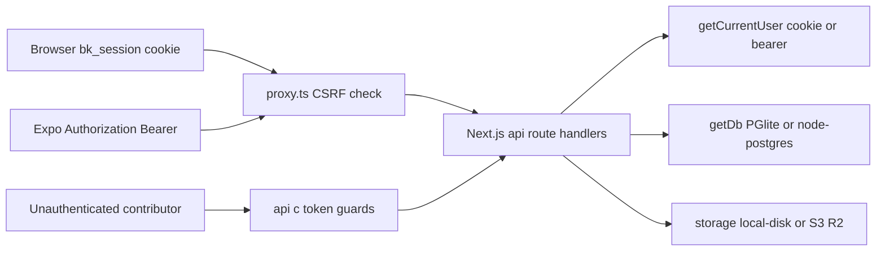

*Extracted from the `motivation` repo source on 2026-06-20, checked against the code and cross-checked by a second adversarial pass. Numbers are measured, not estimated.*

## The shape of the system

Beside (곁) is a private "support-box" PWA plus an Expo mobile client: an owner stores text, photo, audio, and video encouragement items, invites other people via unauthenticated token links, and receives timed push reminders. The single Next.js 16 codebase runs entirely on a laptop with zero external accounts — embedded PGlite DB under `.data/pglite`, local-disk media, and an auto-generated `SESSION_SECRET` plus VAPID keypair written to `.data/secrets.json` — and promotes to production infra (Postgres over Drizzle, S3/R2 media, Web and Expo Push, Terraform across AWS/OCI/NCP) by setting env vars only. The same `/api` contract is consumed by the browser over a cookie session and by the native app over a bearer token.

| Surface | Size |
| --- | --- |
| App/lib/component TS | 6,822 LOC |
| API route handlers | 26 |
| Postgres tables (Drizzle) | 6 |
| Env-var driver switch points | 3 files |
| Terraform files (AWS + OCI + NCP) | 10 |
| Automated tests | 0 |
| TODO/stub markers | 26 (19 English-only) |

## Request path

Both clients hit a same-origin CSRF check in `proxy.ts` (matcher `/api/:path*`) on every mutating request before reaching the route handlers. Auth runs through `getCurrentUser` in `lib/auth`, which reads the HMAC-SHA256 signed cookie first and an `Authorization: Bearer` token of the same format second; OAuth identities (Apple/Google/Kakao) arrive as identity-token JWTs verified server-side. The unauthenticated contributor `POST` is the one public write path and passes its own stack of guards.

## One codebase, two backends — driver swap by env var

`getDb()` in `lib/db/index.ts` dynamically imports `drizzle-orm/node-postgres` plus a `pg.Pool` when `DATABASE_URL` is set, and otherwise falls back to embedded PGlite (`@electric-sql/pglite`) writing to `.data/pglite`, cast to `NodePgDatabase` so the query API is identical at every call site. Migration runs raw DDL once — `pool.query(DDL)` for Postgres, `client.exec(DDL)` for PGlite — guarded by a `globalThis.__bk_ready` promise so tables are ensured exactly once per process (`lib/db/init.ts`). Storage mirrors the pattern: `lib/storage/index.ts` picks `S3StorageDriver` versus `LocalStorageDriver` on `process.env.S3_BUCKET` behind a single `StorageDriver` interface, and `lib/env.ts` `getSecrets()` auto-generates `SESSION_SECRET` (via `crypto.randomBytes`) and a VAPID keypair into `.data/secrets.json` when env vars are absent, with a read-only-filesystem fallback to memory-only.

The trade-off is centralization: selection is dynamic-imported so each environment loads only its own dependencies, but it also means the entire local/prod behavioral split lives in three files. Get one branch wrong and the same artifact behaves differently than the deploy it was tested against.

## Stateless signed-cookie sessions, bearer fallback for mobile

`lib/auth/index.ts` issues HMAC-SHA256-signed tokens of `base64url(uid.exp)` with a 180-day expiry (`MAX_AGE_SECONDS = 60*60*24*180`), verified with a constant-time `safeEqual` over `crypto.timingSafeEqual` in `lib/tokens.ts`. `getCurrentUser()` reads the httpOnly `bk_session` cookie first, else the bearer token of the same format — the scheme the Expo app uses over the identical `/api/*` contract. `establishUser()` upserts user and box together (one box per owner, enforced by `.unique()` on `boxes.owner_id`) and is shared by dev login and the OAuth callbacks.

One signed-token scheme serves browser and native without a session store. The cost is no server-side revocation: a 180-day bearer token held by a mobile client cannot be invalidated by logout. This is logged as F-005, below.

## Apple identity-token verification from scratch

`lib/oauth/apple.ts` fetches Apple's JWKS (cached one hour) and, for an incoming identity token, checks `header.alg === RS256` plus `kid`, finds the matching RSA JWK, and verifies the RSA-SHA256 signature over the signing input via `crypto.createPublicKey({format:'jwk'})` and `createVerify`. It then validates `iss === https://appleid.apple.com`, an audience match (`appleAudience` from `APPLE_BUNDLE_ID`), `sub` presence, and `exp`/`iat` against a 60-second clock-skew window. `lib/oauth/google.ts` and `lib/oauth/kakao.ts` are parallel modules.

Native Sign in with Apple returns an identity token, not an OAuth redirect, so verifying the JWT signature and claims directly with `node:crypto` avoids a heavyweight auth dependency. The trade-off is hand-rolled crypto-adjacent code that has to be read carefully rather than trusted to a library.

## Owner-gated media route with presigned redirect and Range streaming

`app/api/items/[id]/media/route.ts` requires `getCurrentOwner()` and checks `item.boxId === owner.box.id` before serving any bytes; storage keys are boxId-scoped UUIDs and are never publicly addressable. If the driver exposes `presignedUrl` (S3/R2), the route 302-redirects to a five-minute signed URL (`expiresIn: 300`) with `Cache-Control: private, no-store`; otherwise it streams from local disk with manual `bytes=` Range parsing, returning `206`/`416`, plus `X-Content-Type-Options: nosniff` and `Cache-Control: private, max-age=3600`. The local driver normalizes keys to block `../` path traversal.

Voice and face media are the sensitive data here, so every fetch goes through an auth check rather than a public URL, and `nosniff` blocks a stored-media-as-HTML XSS path. Range support exists because iOS Safari `<audio>` and `<video>` seeking requires it — without `206` responses, playback stalls.

## Layered abuse controls on the one unauthenticated write path

`app/api/c/[token]/route.ts` is the only public write endpoint. The link token is a 32-byte `base64url` cryptographic random string (`newLinkToken` in `lib/tokens.ts`). The `POST` handler applies an early `Content-Length` guard that rejects oversize requests before buffering, dual fixed-window rate limits (per-IP 20 per 60s and per-token 60 per hour via `lib/ratelimit.ts`), an in-memory idempotency cache (`seenIdempotencyKey`) to dedupe double-submits, expiry checks, and per-type MIME allow-lists in `lib/constants.ts` where `svg` and `html` are intentionally excluded to block stored XSS. The same-origin CSRF check in `proxy.ts` applies on top.

An open submission endpoint is the highest-risk surface in the system, so the defense is deliberately layered: DoS guard, IP/token throttle, idempotency, MIME allow-list, CSRF origin enforcement. The honest limitation is that the rate limiter and idempotency cache are in-memory — see the warts.

## Dual-trigger reminder scheduler

`lib/scheduler.ts` has one `runDueReminders()` that selects enabled reminders, computes the current `HH:MM` per stored IANA timezone via `Intl.DateTimeFormat`, and fans out to each owner's push subscriptions — routing `s.platform === expo` subscriptions to Expo Push (`lib/expo-push.ts`, the `exp.host` API) and the rest to VAPID Web Push (`lib/push.ts`). Subscriptions whose send returns gone are deleted (web: `404`/`410`; Expo: `DeviceNotRegistered`), so the push table self-prunes. On a persistent host, `node-cron` fires it every minute via `startScheduler`; on Vercel it skips `node-cron` and exposes `app/api/cron/reminders` for an external scheduler, gated by a `CRON_SECRET` bearer or `x-vercel-cron` header.

The same reminder logic runs whether the runtime is a long-lived process or stateless functions. The weak seam is the serverless auth path, noted below.

## A traceable security pass, then an independent review

Commit `ed3600c` ("harden: fixes from adversarial security review") changed 11 files (+224/-55). It disabled dev-login in production, added the upload MIME allow-list and `nosniff`, stopped the service worker from caching authenticated box HTML (`public/sw.js` cache `beotimok-v2`), added media Range/206 support, added the `proxy.ts` CSRF check, added the per-token throttle and content-length guard, and added per-key secret env overrides in `lib/env.ts`. A separate Codex review (`codex_review/full/2026-06-18-1313/comprehensive-review.en.md`) re-audited and logged nine findings F-001..F-009 with severity (3 High, 6 Medium) and confidence.

This is a closed loop: issues from the adversarial pass map to specific committed diffs, and a second independent review documents remaining risk instead of claiming the system is "secure." Some Codex findings (for example F-004) are now stale against current code.

## What this architecture doesn't do

- **The AWS RDS Terraform provisions a public, unprotected Postgres.** `infra/main.tf` sets `publicly_accessible=true` (`:57`), `backup_retention_period=0` (`:59`), `skip_final_snapshot=true` (`:61`), `deletion_protection=false` (`:62`), and the security group opens `0.0.0.0/0` (`:30`, `:37`). That is Codex F-002, High.
- **Rate limiting and idempotency are single-instance only.** `lib/ratelimit.ts` holds buckets in a process-local `Map`; the file comment itself says a durable (Redis) limiter is needed for production. Across multiple instances the limits and dedupe break.
- **Audio transcode is best-effort and currently a no-op; video has none.** `lib/audio.ts` notes that without `ffmpeg` the original is stored as-is, and `ffmpeg` is not installed in this environment, so WebM is stored unchanged and may not play on iOS. `lib/items.ts:141` stores video without any server transcode (Codex F-009).
- **Sessions cannot be revoked.** 180-day stateless signed tokens (`MAX_AGE_SECONDS`) with no server-side store; `logout()` only deletes the cookie, and `getCurrentUser` still accepts a bearer token a mobile client already holds (Codex F-005).
- **Serverless cron auth is spoofable and sends are not durably deduped.** `app/api/cron/reminders/route.ts` `authorized()` returns true on any `x-vercel-cron` header, and `runDueReminders` has no per-reminder-per-minute dedupe, so a double-trigger in the same minute can double-send (Codex F-001, High).
- **No automated tests.** Zero `.test`/`.spec` files; `package.json` scripts are `dev`/`build`/`start`/`lint` only, and the independent review reports the lint gate failing on checked-in source. Verification is manual (Codex F-003, F-008).
- **Contribution links have no default expiry and no revoke path.** `expiresAt` is a nullable timestamp (`lib/db/schema.ts:67`), and the route only checks expiry when it is set, so the default link never expires and there is no delete workflow (Codex F-006).
- **Full export buffers everything in memory.** `app/api/export/route.ts` pushes each item's `storage.get(mediaKey)` buffer into a `ZipEntry[]` and then zips in-memory, which will OOM on a large box (Codex F-007).
