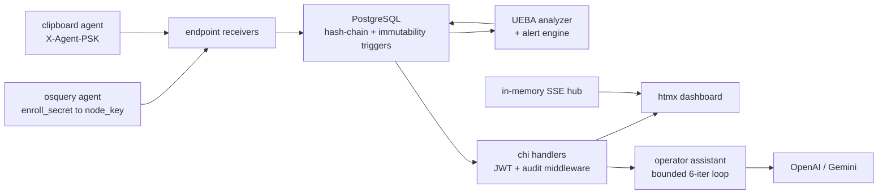

> **In plain words.** DocVault watches a small company's computers for risky activity — a file copied to a USB stick, a sensitive document uploaded — and keeps a log that can't be quietly altered after the fact. The clever part: that "no secret edits" guarantee is enforced by the database itself (each log entry is cryptographically chained to the one before it), not by trusting the app code. Think of a sealed security-camera tape: even the software that writes it can't go back and rewrite history without the seal visibly breaking.

*Extracted from the `docvault` repo source on 2026-06-20, checked against the code and cross-checked by a second adversarial pass. Numbers are measured, not estimated.*

## The shape of the system

DocVault is a self-hosted insider-threat event collector: one stateful Go binary (chi v5 router, pgx v5 driver) that ingests endpoint activity from osquery and a custom clipboard agent over HTTP(S), persists it to PostgreSQL, and serves a server-rendered htmx dashboard. The security-critical integrity work does not live in Go — Postgres does it, via `BEFORE INSERT/UPDATE/DELETE` triggers plus pgcrypto. Optional external agents push events in; an LLM provider (OpenAI or Gemini) is called server-side for the operator assistant. The topology is one Go process talking to one PostgreSQL instance.

| Surface | Size |
| --- | --- |
| Go LOC, all `.go` | 17,783 across 91 files |
| Go LOC, non-test | 13,981 across 64 files |
| Tests | 126 `func Test*` across 27 files, 11 packages |
| SQL migrations | 18 sequential up-migrations |
| Tables | 23 `CREATE TABLE`, all distinct |
| HTTP routes | 102 registrations in `router.go` |
| Largest subsystems | web 4004, endpoint 2893, vault 1558, auth 1304 LOC |

The migration count and the table count are the honest measure of where the weight sits: 23 tables behind 102 routes, with the integrity logic pushed down into 18 ordered SQL files rather than spread through handler code.

## Request path

Events arrive through two doors with different trust models, land in Postgres where the triggers chain and freeze them, and are read back by the analyzer, the dashboard, and the assistant. Nothing in the read path can mutate the log without tripping a trigger.

## The hash chain lives in Postgres, not in Go

The append-only audit story is enforced one layer below the application. `BEFORE INSERT` triggers (`compute_audit_hash`, `compute_endpoint_hash`, in `internal/database/migrations/008_log_integrity.up.sql`) set `row_hash = encode(digest(prev_hash || '|' || <row fields>, 'sha256'), 'hex')` through pgcrypto, chaining each row to the prior row's `row_hash` from a fixed 64-zero genesis. `BEFORE UPDATE/DELETE` triggers (`prevent_log_update`, `prevent_log_delete`) `RAISE EXCEPTION`, so `endpoint_events` and `audit_logs` are append-only even against direct SQL.

The subtle part is migration `013_audit_advisory_lock.up.sql`. It prepends `PERFORM pg_advisory_xact_lock(hashtext('audit_logs_chain'))` to each compute trigger, so two concurrent inserts can't both read the same `prev_hash` and fork the chain — the author found this read-then-write race and filed it as L-SEC-3. The lock is transaction-scoped and auto-releases at `COMMIT`. The trade-off is explicit: inserts into each logged table are now serialized.

## File encryption is chunked and authenticated against truncation and reorder

`EncryptStream` in `internal/vault/encryption.go` splits plaintext into 64 KiB chunks (`chunkSize = 64*1024`), sealing each with its own AES-256-GCM nonce built as `base[0:8] || chunk_index (3 bytes BE) || final_flag (1 byte)`, where the final flag is `0x01` only on the last chunk. The per-chunk index defeats reordering; the final-chunk flag defeats truncation. A `bufio.Peek(1)` finds the true EOF even when the plaintext lands on an exact chunk boundary, and `DecryptStream` returns `truncated ciphertext: missing final chunk` when the last chunk is absent. `maxChunks = 1<<24` caps a file at roughly 1 TiB.

This replaced an earlier unauthenticated AES-CTR scheme (L-SEC-1). Streaming keeps whole files out of memory. The tamper, truncation, and reorder cases each have a named test in `internal/vault/encryption_test.go` (`TestTamperDetection`, `TestTruncationDetection`, `TestChunkReorderDetection`).

## Envelope encryption keeps plaintext keys out of the database

`KeyManager` in `internal/vault/keymanager.go` holds a 32-byte hex master key — `NewKeyManager` rejects anything not 32 bytes — and `GenerateFileKey` returns a random data key alongside its encrypted form and nonce, sealed under the master key with AES-256-GCM. Because the file key is stored in the DB only in encrypted form, keys can rotate without re-encrypting the blobs.

The same master key backs `SecretProtector` in `internal/auth/secret.go`, which seals TOTP seeds with an `enc:v1:` prefix. Un-prefixed legacy values pass through unchanged, so existing enrollments keep working — a versioned migration path, not a flag-day rewrite. Migration `016_totp_secret_encryption.up.sql` widened `users.totp_secret` from `VARCHAR(64)` to `TEXT` to fit the ciphertext.

## Two-tier ingestion auth: shared PSK versus per-node key

Simple receivers in `internal/endpoint/handler.go` authenticate through `requirePSK`, which `subtle.ConstantTimeCompare`s the `X-Agent-PSK` or `X-Osquery-PSK` header against the configured shared secret and fails closed with `503` if the PSK is unset. Constant-time compare avoids a timing oracle on the secret.

The osquery TLS path in `internal/endpoint/osquery_tls.go` is different. `OsqueryEnroll` validates `enroll_secret`, mints a random per-node `node_key`, and upserts into `endpoint_agents` with `ON CONFLICT(hostname, source)`. Later config and log calls resolve `node_key` to hostname and `user_id` under `WHERE is_active = true` and bump `last_checkin`. This matches osquery's real TLS-logger protocol, so stock osquery runs unmodified, and it gives per-node revocation through `is_active` that the flat PSK path doesn't have.

## The operator assistant enforces mutations at the server, not the model

`Engine.Chat` in `internal/agent/agent.go` runs a bounded `for i := 0; i < 6` loop over a `Provider` interface (`OpenAIProvider` or `GeminiProvider`, picked by which key is configured). Read tools run immediately. The 3 mutating tools — `create_user`, `assign_host`, `acknowledge_alert` in `internal/agent/actions.go`, each marked `RequiresConfirmation: true` — are blocked by `callsNeedingConfirmation` unless `confirmed = hasActionConfirmation(userMessage) && historyHasPendingConfirmation(history)`.

The split matters: the confirmation phrase is read only from the human user message, and the pending prompt only from prior assistant messages, so a confirmation can never arrive through tool output. The confirmation phrases are Korean and English (`실행 승인`, `yes execute`). The system prompt marks all tool-returned data — filenames, window titles, process names — as untrusted and forbids acting on instructions embedded in it. Because the assistant reads attacker-influenced surveillance data, the server is the enforcement point for state changes; the 6-iteration cap bounds runaway tool loops and cost.

## Audit is middleware; the binary owns its own lifecycle

A chi middleware in `internal/audit/middleware.go` wraps each request with a `statusRecorder` (and a `Flusher`-preserving `flushStatusRecorder` variant for SSE), derives a typed `Action` from method and path via `deriveAction`, and writes an `audit_logs` row that the DB trigger then chains. New routes get logged without per-handler code. `VerifyHashChain` in `internal/audit/repository.go` is a standalone verifier that walks rows by id from the 64-zero genesis and, on the first row where `prev_hash` doesn't match the prior row's `row_hash`, sets `BrokenAt` and `IsIntact = false`.

Deployment is one binary. Migrations are `go:embed`'d through `MigrationsFS` (`internal/database/migrations.go` holds only the embed directive); `runMigrations` in `cmd/server/migrate.go` creates `schema_migrations`, then for each unapplied sorted file opens its own pgx transaction, `Exec`s the SQL, inserts the version row in the same transaction, and commits — rolling back the whole file on any error, so a failed migration leaves a clean, retryable state. `main.go` dispatches `serve` / `migrate` / `seed` off `os.Args`. Live dashboard updates run through an in-memory `SSEHub` in `internal/web/sse.go`: a `map[*sseClient]bool` under a `sync.RWMutex`, a 64-buffered channel per client, and a 30s heartbeat.

## What this architecture doesn't do

- The hash-chain verifier checks linkage only, not content. `VerifyHashChain` compares `prev_hash` to the prior row's `row_hash` but never recomputes `row_hash` from the row's columns, so a self-consistent rewrite of both columns would pass — the `UPDATE/DELETE` triggers are what actually block the normal write path.
- The threat model is openly narrow. A Postgres superuser can `ALTER TABLE audit_logs DISABLE TRIGGER ALL`, rewrite rows, recompute hashes, and re-enable, leaving no trace. `docs/LIMITATIONS.md` (L-SEC-2) and the README state plainly this is not legal-grade evidence — there is no RFC-3161 timestamping or WORM mirror.
- JWT refresh is stateless with no rotation or denylist. `Refresh` in `internal/auth/handler.go` re-issues a token pair via `GenerateTokenPair` but never revokes the presented token or tracks a token family. A leaked refresh token (`refreshTokenDuration = 24*time.Hour`) stays valid until expiry, and logout can't kill it server-side.
- The non-osquery agent path is a single shared PSK (`X-Agent-PSK`) for event, heartbeat, and enroll endpoints. One leak compromises every agent, with no per-agent revocation. mTLS is named as the fix (L-SEC-4) but is not implemented — no `tls.Config` / `ClientAuth` in non-test code.
- Audit action derivation uses string matching — `strings.HasSuffix(path, "/login")`, `strings.HasPrefix(path, "/api/files/")` — flagged as fragile (L-SEC-5). A future route sharing a suffix would be mislabeled.
- Single-instance assumptions are baked in. The SSE hub (`internal/web/sse.go`) and the login rate limiter (`internal/web/ratelimit.go`) are both in-process `map` + mutex, so horizontal scaling would silently break live updates and per-IP brute-force protection across replicas.
- Threshold-based alerting is scaffolded, not wired. `alert.RuleCondition.MinCount` exists in the model but carries a `// future: threshold-based alerting` comment in `internal/alert/engine.go` and is not evaluated.
