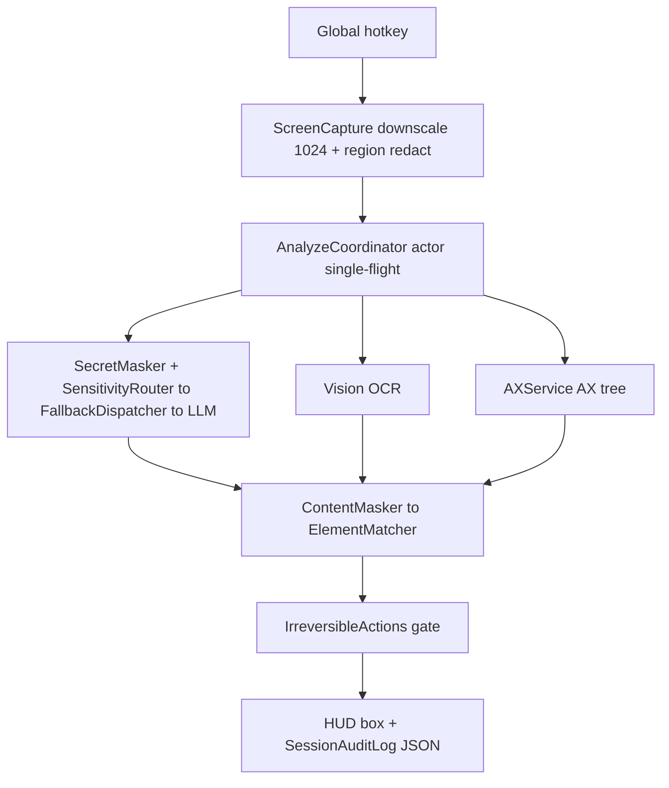

> **In plain words.** ScreenBridge is a Mac tool: press a hotkey, it takes a screenshot, asks an AI "where do I click to do X," and draws a box on the exact spot. The hard part is hitting the *right pixel* — so it cross-checks the AI's rough guess against the Mac's own list of on-screen buttons and always trusts the precise one over the AI's estimate. Before any image or text leaves your computer it blacks out passwords, card numbers, and banking apps, and anything irreversible (sending money, deleting) waits for your confirmation.

*Extracted from the `jarvis-pc` repo source on 2026-06-20, checked against the code and cross-checked by a second adversarial pass. Numbers are measured, not estimated.*

## The shape of the system

ScreenBridge is a native macOS menu-bar app (Swift 6.3, SwiftUI + AppKit, SwiftPM, macOS 14+) that turns an abstract AI instruction into a concrete on-screen pointer target. On a global hotkey it captures the display under the cursor with ScreenCaptureKit, fans out in parallel to a vision LLM (Anthropic Claude or Gemini in the cloud, or a local Qwen via MLX), Vision-framework OCR, and the Accessibility (`AXUIElement`) tree, then deterministically fuses the OCR and AX candidates — preferring exact AX coordinates over the LLM's estimate — and draws a HUD box. Everything runs locally; the only network egress is the vision-LLM call, gated by a privacy chokepoint before any pixels or text leave the device. The project is a rewrite: an earlier Tauri attempt leaked the device-pixel-ratio across coordinate spaces and broke on external monitors, which is why the coordinate math is now centralized in native code.

| Surface | Size |
| --- | --- |
| Swift source | 5,808 LOC, 42 files |
| Swift tests | 2,256 LOC, 16 files, 150 test functions |
| Privacy filters | 16 secret-mask patterns, 17 deny-list bundle IDs |
| Safety gates | 35 irreversible-action keywords, 17-role AX whitelist |
| History | 123 commits |

## Request path

## The analyze pipeline is one actor with a single-flight guard

`AnalyzeCoordinator.swift` is an `actor`, so every analyze run is serialized without explicit locks — the project compiles under Swift 6 strict concurrency (`swiftLanguageModes: [.v6]`), and the actor isolation is what makes the shared session state safe. `run()` rejects re-entrancy with an `isRunning` boolean guarded by a `defer` that resets it, returning a `.failed` result with the message "이미 분석 중" if a second trigger arrives mid-run. Inside a run it fires three concurrent `async let` futures — the vision LLM dispatcher, `ocr.recognize`, and `ax.queryAllElements` — and awaits all three.

The failure policy is asymmetric on purpose. An LLM failure is fatal and returns `.failed`. OCR and AX failures are caught and degrade to empty arrays, because some apps (Electron, per a code comment) return an empty AX tree, and the tool should still produce a coordinate from the remaining sources. The fan-out also hides OCR and AX latency behind the LLM round-trip, which is the slowest leg anyway. The actor additionally owns the `SessionState` enum (`idle` / `analyzing` / `waitingForUserClick` / `completed` / `cancelled`), the step history, and a 45-second idle deadline.

## OCR and AX candidates are fused deterministically, ranked above the LLM

`ElementMatcher.swift` (`matchTop`) unifies OCR boxes and AX elements into a single `MatchCandidate` list and resolves the LLM's `target_text` in three stages. First, a spatial-fusion proximity filter keeps candidates within ±100 pt of the LLM's coordinate hint, falling back to the full set if nothing is nearby. Second, an NFC-normalized case-insensitive substring match, preferring the shortest text, then the AX source, then confidence. Third, a Levenshtein normalized-similarity fuzzy fallback with a length-aware threshold — 0.7 by default, tightened to 0.85 for text of 6 characters or fewer to stop "Save"/"Same" type false positives. It returns the top two distinct matches (more than 50 pt apart) so the user picks the final target.

The ranking is the point. AX elements carry real pixel rects and are assigned confidence 1.0, where the vision LLM only estimates coordinates, so preferring deterministic sources over the LLM hint reduces wrong-box clicks. The NFC normalization specifically fixes Korean Hangul NFD-vs-NFC mismatches that otherwise fail silently. This logic carries the heaviest test weight in the repo: 22 of the 150 test functions live in `ElementMatcherTests.swift`.

## Coordinate transforms live in one type so DPR and multi-monitor bugs can't spread

`DisplayGeometry.swift` captures `displayID`, `screenFrame`, `backingScaleFactor`, `physicalSize`, and `sentSize`, then exposes the two transforms that matter. `logicalRectFromSentBox` converts sent-pixel coordinates to physical pixels by ratio and then to logical points via `backingScaleFactor`, rejecting negative width or height. `globalAppKitRect(fromLocalTopLeft:)` adds the screen origin and performs the bottom-left y-flip in one place. `currentScreen` re-resolves the `NSScreen` by `displayID` so the math survives a hotplug or resolution change, and a comment explicitly bans `NSScreen.main`.

This whole type exists because the prior Tauri build leaked the device-pixel-ratio across coordinate spaces and used `NSScreen.main`, which broke on external monitors. Centralizing the four-layer transform and banning the global-screen shortcut is what makes the box land on the right pixel on Retina and multi-monitor setups. The trade-off, called out below, is that only the cursor's display is ever analyzed — multi-display was descoped after the Tauri attempt failed on it.

## The vendor fallback swaps only on quota, and the vision call is forced into JSON

`FallbackDispatcher.swift` is an `actor` conforming to `LLMDispatcher` that wraps a primary and a fallback. Its `shouldFallback(on:)` swaps only on `.retriesExhausted(429)` or `.httpStatus(429)` and re-throws every other error — network, decoding — so that bugs in the primary surface instead of being masked by a silent failover. `AppDelegate.swift` builds the chain at launch from environment keys: Gemini to Claude by default, or `SCREENBRIDGE_USE_LOCAL=1` makes local Qwen primary with cloud fallback. `ClaudeDispatcher.swift` runs its own exponential backoff (`pow(2, attempt-1)` plus jitter, retrying statuses `{429, 500, 502, 503, 504}`, `maxAttempts` 2) before reporting `retriesExhausted`, which separates transient throttling from genuine quota exhaustion.

The same `ClaudeDispatcher.swift` forces structured output. It sends the base64 image and instruction to the Messages API with one tool, `respond_with_analysis`, and `tool_choice` of `{type: "tool", name: "respond_with_analysis"}`, so the model must emit a schema-shaped JSON block (`screen_state`, `next_action`, `target_text`, `target_role`, `coordinates`, `requires_confirmation`, `task_complete`, `step_action_summary`) rather than prose. The `tool_use` input decodes straight into `AnalysisResult` (`AnalysisResult.swift`). There is hand-rolled `JSONValue`/`AnyEncodable` type-erasure to carry the JSON-Schema dictionary as a `Sendable Encodable`, because — per a code comment — Swift 6 `Sendable` and `JSONSerialization`-as-`Encodable` don't compose out of the box.

## Privacy is a chokepoint enforced before any cloud egress

The ordering inside `run()` is the privacy design, layered. `SensitivityRouter.swift` checks the frontmost `bundleID` against a 17-entry hardcoded deny-list (5 password managers, 7 Korean banks, 4 Korean cards, Mail) and is fail-closed: a sensitive app with no local model installed aborts with `.blockedLocalModelNotInstalled` rather than calling the cloud. `SecretMasker.swift` regex-redacts the instruction with 16 compiled patterns (Anthropic/OpenAI/Google/AWS/GitHub keys, Slack tokens, PEM blocks, Korean RRN, mobile, bank, business number, driver license, passport) before the LLM or the audit log ever see it. `ContentMasker.swift` drops OCR and AX candidates that match those same patterns, so the LLM can't be handed a card-number row as a click target. `ScreenCapture.swift` paints user-drawn redaction regions black on the downscaled image. `SessionAuditLog.swift` persists masked, text-only JSON per session, atomically, and never writes a screenshot.

Masking before both the network call and disk persistence is what makes sending a user's screen to a third-party LLM defensible: a secret never leaves the device and is never written even to a local log. The code and comments label this a "5-layer" design; in this revision the region opt-out (L3) and Qwen-local path (L4) are marked v0.3 in progress. `SecretMaskerTests.swift` carries 17 tests against the redaction patterns.

## Two safety gates: a keyword OR-gate and a bounded AX walk

`AnalysisResult.swift` and `AnalyzeCoordinator.swift` together form the irreversible-action gate. The coordinator computes `isIrreversible = result.requiresConfirmation || IrreversibleActions.isIrreversible(...)`, where `IrreversibleActions` keyword-scans `next_action` and `target_text` against 35 destructive terms (18 Korean — 송금/이체/결제/삭제/확정 — plus 17 English — send/delete/transfer/pay/submit). If the LLM omits the confirmation flag, the backend forces `requires_confirmation = true` and logs `[safety] keyword post-filter → requires_confirmation forced true`. The LLM is non-deterministic and will occasionally forget to flag a money transfer or a delete; this deterministic OR-gate is the net that stops a missed flag from auto-advancing the user toward an irreversible click.

`AXService.swift` (`LiveAXService`) walks `NSWorkspace.runningApplications` (regular apps plus `com.apple.dock`) and recurses the `AXUIElement` tree to `maxDepth` 8, keeping only a 17-role clickable/visible whitelist (`AXButton`, `AXLink`, `AXMenuItem`, `AXDockItem`, `AXOutlineCell` for the VS Code sidebar, and so on). The depth and role limits keep an otherwise slow and noisy full-tree walk fast enough to run in parallel with the LLM call. `AXDockItem` is the role that locates icon-only Dock apps that OCR can't read. The AX attribute keys are string literals (`"AXRole"` and friends) rather than the extern `kAX*` constants, because — per a code comment — Swift 6 strict concurrency rejects the extern vars.

## What this architecture doesn't do

- **Audit logs accumulate forever.** The 7-day auto-deletion under `~/Library/Application Support/com.screenbridge.app/sessions/` is a TODO (`SessionAuditLog.swift:16`, "7일 후 자동 삭제 (TODO Phase 7.4)"); no deletion code exists yet.
- **Privacy mode needs a restart.** Switching between local and cloud requires relaunching the app — there is no runtime swap (`SettingsView.swift:31`; `PrivacySettings.swift:8` marks runtime swap as v0.4).
- **The deny-list is hardcoded.** The planned MDM/plist admin config isn't built, and Mail is matched at whole-app granularity — compose-window detection is deferred to v0.4 (`SensitivityRouter.swift:35`, `:61`).
- **First Claude call after a Gemini swap pays full cold latency.** `ClaudeDispatcher.prewarm()` is a deliberate no-op because Anthropic exposes no public health endpoint (`ClaudeDispatcher.swift:102-105`).
- **No "you have a secret" alert.** `SecretMasker.detect()` exists but its user-facing alert is still a TODO, and email PII is intentionally never masked in instructions (`SecretMasker.swift:90`; mask commented out at `:54-56`).
- **Single display only.** Only the cursor's monitor is analyzed; multi-monitor was explicitly descoped after the Tauri attempt broke on it (`README.md:107`).
- **Best-effort persistence and scaffolded state.** The `SessionState` machine was added ahead of full wiring (`AnalyzeCoordinator.swift:20`, "Phase 7.0: SessionState scaffold"), and audit-log writes silently swallow failures so a log error can't block a session (`SessionAuditLog.swift:74`).
- **Not shipped.** No notarized or signed build yet — the README states an ad-hoc-signed Beta DMG only, with a target ship date of 2026-06-27 (`README.md:13`, `:15`, `:48`).
- **Stale comments.** `ScreenCapture.swift` and `DisplayGeometry.swift` still reference a 1568 downscale cap in comments, but the live constant is `maxDimension = 1024` (`ScreenCapture.swift:19` vs comments at `:5`, `:16`, `:105`; `DisplayGeometry.swift:8`, `:27`).
