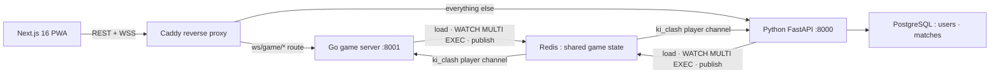

> **In plain words.** Ki Clash is a fast 1v1 online game — a digital version of the Korean schoolyard "기싸움." The engineering story is the backend: two separate server programs, one written in Python and one in Go, run the exact same game off one shared memory store (Redis), so either can handle any player. The tricky bug they guard against is two players moving in the same instant and overwriting each other's result; they use a "read, then commit, retry if someone beat you to it" pattern — like two referees sharing one scorebook and never writing on the same line at once.

*Extracted from the `ki-clash` repo source on 2026-06-22, checked against the code and cross-checked against the engineering log. Numbers are measured, not estimated.*

## The shape of the system

Ki Clash is a real-time 1v1 turn game with an unusual backend: **two server runtimes, Python and Go, that serve the same game over the same Redis state**. A Next.js 16 PWA talks REST + WebSocket to a Caddy reverse proxy; Caddy routes the gameplay WebSocket to whichever runtime is wired in, and everything else to Python. Per-game state lives only in Redis, so either runtime can serve any connection. PostgreSQL holds the durable rows (users, matches); Redis holds the live game.

| Surface | Size |
| --- | --- |
| Python (FastAPI) | 5,671 LOC |
| Go (game server) | 2,082 LOC |
| Web (Next.js, TS/TSX) | 13,997 LOC |
| Tests | 151 Python `test_*` + 13 Go `Test*` |
| Live Redis keyspace | 4 namespaces — `ki_clash:game:{id}`, `ki_clash:room:{code}`, `ki_clash:matchmaking:queue` (ZSET), `ki_clash:player:{id}` |
| Fighter sprites | 36 PNGs (6 characters × 6 poses) |
| Design records | DR-1 … DR-15, in a 2,512-line engineering log |
| Commits | 136 |

## Process model

One match, two runtimes, one Redis. Both speak the same JSON envelopes, write the same keys, and verify the same JWT — Caddy is the only switch.

## Two runtimes over one Redis truth

The Go server's own header says it plainly: `session.go` "ports `app/modules/ki_clash/game_session.py`" as a "stateless façade — every method takes `game_id` and operates on Redis session state." Nothing about a game lives in process memory except the open WebSocket itself; the authoritative `PvPSession` is a JSON blob at `ki_clash:game:{game_id}`. That is the precondition that makes a Go process and a Python process interchangeable for a given connection (decision DR-15).

Because both runtimes read and write the same blob with the same envelope shapes and the same JWT secret, promoting Go from "verified" to "authoritative" is a one-line Caddy change — the `ws/game/*` route already points at `game:8001` in the production Compose file; Python serves real users until that line is uncommented.

## Optimistic concurrency, ported across both languages

Two players can submit in the same sub-millisecond window, so turn state is mutated under Redis optimistic concurrency, not a pessimistic lock. Python's `watch_and_update` (`app/core/game_store.py`) opens a pipeline, `WATCH`es the game key, runs the caller's mutation closure, then `MULTI` / `EXEC`s — retrying on a watch conflict up to a fixed budget and raising once the budget is exhausted. Go's `Store.watchAndUpdate` (`go-server/store.go`, driving every mutation in `go-server/session.go`) implements the identical load → watch → mutate-closure → exec → retry shape. The same concurrency contract exists twice, once per runtime, by construction (DR-14).

The trade-off is stated in the code: a single-round-trip Lua version was written (`go-server/submit_action.lua`) and reverted, because Redis's `cjson` collapses an empty array to an empty object (`round_results: []` → `{}`), which then fails Python's Pydantic on read. At single-digit-per-day contention, `WATCH` / `MULTI` / `EXEC` is simply correct and the Lua path is deferred — the reasoning is a comment block above `submitAction`, not a lost decision.

## Simultaneous actions as a two-envelope atomic resolve

A turn only resolves when both players have moved. `submitAction` stores `p1_action` or `p2_action` into the session inside the atomic update; when both are present it sets a resolve flag and **clears both fields in the same `EXEC`** that stored the second one. There is no window where one action is set and a stale worker reads the other mid-flight. Action validity (can the player afford the ki cost) is checked inside the same critical section, against the round's current ki, before the action is accepted.

## Cross-runtime push via per-player pub/sub

When the server needs to push to a player it writes to the local WebSocket if it holds it; otherwise it `PUBLISH`es on `ki_clash:player:{id}` and whichever instance holds that connection relays it (DR-13). This is what makes a *cross-runtime* push correct — a Python worker can deliver to a player whose socket is held by the Go server, and the reverse — without either side knowing where the connection lives.

## The four concurrency bugs are in the code, not just the changelog

An in-process PvP simulator (`scripts/pvp_simulator.py`) surfaced four real distributed-state bugs, and the fixes live as commented invariants in `session.go`:

- **Reconnect misclassification.** A disconnect removes the player from `connected_players`, so keying "is this a reconnect" on `HasConnected()` made every reconnect look like a first connect and never fired `opponent_reconnected`. The fix keys on `Started && !wasLive` and re-adds presence on every reconnect — otherwise the 30-second forfeit timer still fires on a player who already came back.
- **Double-start.** `start()` is idempotent behind a `Started` guard and a `len(connected) == 2` gate, so the second connector kicks off turn 1 and the turn clock never runs while a player is still loading.
- **Message ordering.** `action_confirmed` envelopes carry the explicit `turn_number` they apply to, so a stale confirm for turn 5 can't be read as confirming the turn-6 submission already in flight.
- **Disconnect resolution across instances.** The 30-second forfeit timer re-reads Redis when it fires; if `connected_players` shows the player reconnected to *any* worker in the window, the forfeit is a no-op. Both runtimes update the same set.

## One engine, resolved identically in two languages

The rules are constants (`app/core/game_engine/types.py`: ki cap 10, 20-turn round limit, best of 3, a 5-second turn clock that auto-submits `charge`). The outcome of a turn is a hand-tuned 5×5 table mapping `(p1_action, p2_action)` to a result (`Attack` beats `Charge`; `Ki Burst` pierces `Block` but is dodged by `Teleport`; `Attack` × `Attack` is a clash). The table is tested cell-by-cell in **both** `tests/core/test_game_engine.py` and `go-server/engine_test.go`, which is how "both runtimes resolve identically" stops being an aspiration.

## What this architecture doesn't do

- **The Go runtime is verified end-to-end but not yet authoritative.** `go-server/test_e2e.py` spawns a real game via Python REST, connects both players over Go's WebSocket, and asserts correctly personalized `turn_result` envelopes — but the production Caddy route still serves real users from Python. Flipping it is a one-line uncomment plus a redeploy, not a code change.
- **Cross-instance correctness is reasoned, not yet stress-tested.** The per-player pub/sub and Redis-re-read-on-timer design is multi-instance-safe by construction and confirmed by code review, but it has not been run against an actual multi-instance deploy under load.
- **No automated frontend tests.** The 151 Python and 13 Go tests cover the engine, matchmaking, the store, the AI opponent, pub/sub, and an integration PvP flow; the ~14k-LOC React frontend is verified by hand.
- **Sprite provenance needs a commercial answer.** The 36 fighter PNGs are AI-generated (Pollinations/flux, then `rembg`/U2Net to strip backgrounds). One was already regenerated for landing too close to a licensed character; the `/fighters/<id>/<pose>.png` layout makes a swap to commercially-indemnified art a drop-in with no code change.
- **Mobile (Expo) is paused** on a React 19 / Reanimated peer-dependency conflict; it runs as a PWA on mobile browsers in the meantime.
