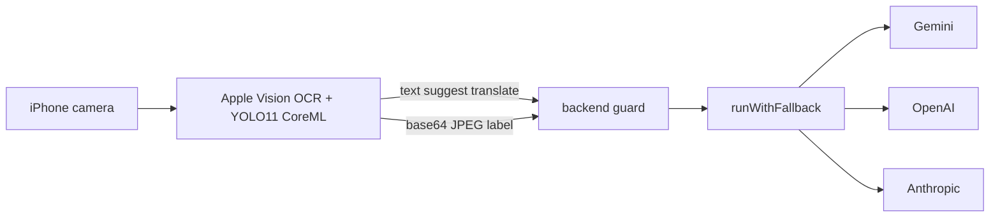

*Extracted from the `meta-smart-glass` repo source on 2026-06-20, checked against the code and cross-checked by a second adversarial pass. Numbers are measured, not estimated.*

This one is earlier-stage than the other deep-dives. The headline feature — a BLE bridge from Meta Ray-Ban Display glasses to the phone — is documented but not yet written. What exists today runs entirely on the iPhone's own camera and talks straight to a backend. I'll say so plainly rather than describe the diagram in the README.

## The shape of the system

A two-part real-time English assistant for Korean speakers. A SwiftUI iOS app does on-device camera capture, Apple Vision OCR, and YOLO11n CoreML object detection, then calls a stateless Bun + TypeScript backend over HTTPS. The backend is a thin LLM-orchestration and key-protection edge: it fans text requests out to Gemini, OpenAI, and Anthropic with key-gated fallback, while object labeling (vision) is Gemini-only and bypasses that chain.

| Surface | Size |
| --- | --- |
| Backend TS (src) | 864 LOC |
| iOS Swift | 1,352 LOC, 12 files |
| HTTP endpoints | 4 — three POST `/api`, one GET `/health` |
| LLM providers wired | 3 — gemini, openai, anthropic |
| Provider impls | 120 LOC — gemini 50, anthropic 35, openai 35 |
| YOLO11n CoreML model | 5.2M |
| CoreBluetooth refs in app | 0 |
| Backend unit tests | 14 — 5 http, 9 parse |
| Git commits | 23 |

## Request path

The app keeps raw images on-device for the translate path; only extracted text crosses the network. The label path is the exception — it sends a base64 JPEG, because object labeling is the one thing not done on-device.

Note the box that isn't here: there is no glasses node. `BackendClient.swift` carries the comment `글래스 도착 전이라 폰↔백엔드만` — "glasses haven't arrived, so it's phone-to-backend only."

## Key-gated provider fallback chain

`runWithFallback()` in `backend/src/api/llm.ts` filters the `PROVIDERS` registry down to providers whose env key is actually set, then tries them in a fixed `ORDER = ['gemini','openai','anthropic']`. Each call is wrapped in `withTimeout()` (`PROVIDER_TIMEOUT_MS` default 20000ms) and followed by an `args.parse()` pass; a parse throw is caught as that provider's failure and the loop advances. If no key is configured it throws `NoProviderError`; if every configured provider fails it throws an error aggregating the per-provider strings. `getSuggestions()` and `getTranslation()` use the chain. `labelObjects()` deliberately does not — it calls Gemini's `completeVision` only, and throws `NoProviderError` without `GEMINI_API_KEY`.

The trade-off is deliberate: free-tier Gemini is primary, paid OpenAI and Anthropic are graceful degradation. Tying availability to which env key exists means the same binary runs in dev (one key) and prod (all three) with no config branching, and a stuck provider can't hang a request past 20s. The cost is that the ordering is hardcoded, not weighted by latency or price.

## HTTP edge: auth, rate limit, error redaction

`guard()` in `backend/src/http.ts` wraps every `/api` handler with three things. First, `checkAuth()` uses `node:crypto` `timingSafeEqual`, length-checked first because `timingSafeEqual` throws on a length mismatch. Second, a per-IP fixed-window in-memory rate limiter (`RATE_MAX` default 60/min, a module-level `Map` of buckets, with `sweepBuckets()` running only once `buckets.size >= 1024`). Third, a try/catch that funnels exceptions through `fail()`, which `console.error`s the internal detail server-side but returns only a stable error code plus a `requestId` to the client. `clientIp()` reads `X-Forwarded-For` first (for the proxy / App Runner deployment), falling back to `server.requestIP`. `AUTH_REQUIRED` is derived from `API_TOKEN.length > 0`, with a startup `console.warn` when it's open.

The expensive surface here is the LLM and vision calls, so the chokepoint is auth plus rate-limit plus payload size, not data volume. Timing-safe compare avoids token-guessing side channels; redacting errors avoids leaking provider or stack detail. The accepted trade-off is that the limiter is in-memory, so it's correct only for a single instance.

## Image validation before vision spend

`validateImage()` in `backend/src/http.ts` (called by `handleLabel` in `backend/src/api/label.ts`) runs four cheap checks before any Gemini call: a MIME allowlist (`image/jpeg`, `image/png`); a fast base64-length byte estimate cut (`image.length*3/4` against `MAX_IMAGE_DECODED_BYTES` = 6MB); an actual `Buffer.from(image,'base64')` decode bounded by the same 6MB; and magic-byte checks (`FF D8 FF` for JPEG, `89 50 4E 47` for PNG) that must agree with the declared MIME. Upstream, `readJson()` rejects on the declared `Content-Length` and again on the real `req.text()` length over the limit (32KB for text, 10MB for an image body) before `JSON.parse`.

A vision call is the most expensive operation in the system, so validating MIME, size, and magic bytes rejects forged or garbage payloads before money is spent. The two-stage size check — declared header first, then real length — defends against a lying `Content-Length`.

## Structured-output contract with a lenient parser

Each provider requests JSON-constrained output its own way: Gemini sets `responseMimeType` to `application/json`, OpenAI uses `response_format` `json_schema` with `strict:true`, Anthropic uses `output_config.format` `json_schema`. But `backend/src/parse.ts` does not trust any of them. `extractJsonObject()` slices from the first `{` to the last `}` to survive stray prose; `toSuggestion`/`toLabeledObject` validate and coerce per field (an unknown tone is normalized to `safe`, a missing or non-string `korean` coerced to `''`); and `parseSuggestions`/`parseObjects` throw if zero valid items survive, which marks the provider failed and advances the chain.

Three providers with three different structured-output mechanisms can't be trusted to all return clean JSON. A permissive parser that still hard-fails on an empty result gives both robustness (one stray sentence won't break it) and correctness (an unparseable response triggers fallback instead of returning junk). `backend/src/prompt.ts` and `backend/src/types.ts` hold the prompt text and the field contract.

## On-device live detection pipeline

`LiveDetector` (`@MainActor`) in `ios-app/SmartGlass/LiveDetection.swift` runs an `AVCaptureSession` feeding a serial video `DispatchQueue`. The nonisolated `captureOutput` delegate runs a `VNCoreMLRequest` against YOLO11 per frame, off the main actor, keeping detections above confidence 0.5. It converts Vision's bottom-left boxes to SwiftUI top-left coordinates (`y = 1 - maxY`), then `stabilize()` matches detections across frames by label plus `IoU > 0.3`, EMA-smooths boxes via `lerpRect(t=0.4)`, keeps tracks alive for 6 ticks to cut flicker, and hops only the `Sendable` `Detection[]` back to `@MainActor`. `vnModel` and the tracking state (`tracked`, `frameTick`) are `nonisolated(unsafe)`, guarded by the serial queue; `SessionBox` (in `ios-app/SmartGlass/Camera.swift`) is an `@unchecked Sendable` box so `start`/`stopRunning` run off-main inside `Task.detached`. The model loads the compiled `yolo11n.mlmodelc` at `LiveDetection.swift:86`.

Per-frame ML inference can't block the UI thread. The serial-queue plus `Sendable`-boundary design satisfies Swift 6 strict concurrency, while the IoU/EMA stabilizer turns jittery per-frame detections into stable on-screen labels.

## Privacy split: only text leaves the phone

`recognizeText()` in `ios-app/SmartGlass/OCR.swift` runs Apple Vision's `VNRecognizeTextRequest` (`recognitionLevel .accurate`, `recognitionLanguages ['en-US']`, `usesLanguageCorrection true`) on-device and returns only the joined string. The image stays local; only text is POSTed to `/api/translate` through `ios-app/SmartGlass/BackendClient.swift`. `WordStore` (`@MainActor`, in `ios-app/SmartGlass/WordStore.swift`) persists encountered words to `Documents/seen-words.json` via `Codable` with lowercase-keyed dedup and a `seenCount` increment; `save()` encodes on the main actor, then writes the `Data` off-main via `Task.detached { try? data.write(to: url, options: .atomic) }`.

Keeping OCR and detection on-device means raw camera frames never hit the network on the translate path — a privacy and latency win — and only the minimal text payload crosses HTTPS. The word store is the persistence seed for a spaced-review feature that isn't built yet.

## What this architecture doesn't do

- **The BLE bridge does not exist.** There is zero `CoreBluetooth` / `CBCentralManager` / `CBPeripheral` code in the app. `README.md` and `docs/architecture.md` both draw `[Glasses] <-BLE-> [iPhone App] <-HTTPS-> [Backend]`, but the README's own status line says `🚧 Phase 1 - Validation`. The app uses the iPhone's own camera and talks directly to the backend. The glasses hop is aspirational.

- **Provider-priority comments are stale and contradictory.** Both `openai.ts` and `gemini.ts` headers say `Primary 프로바이더`, but the real `ORDER` in `llm.ts` is `['gemini','openai','anthropic']`, so OpenAI is actually a secondary fallback. Only `anthropic.ts` correctly labels itself `Fallback`.

- **Rate limiter and request-id counter are single-instance only.** Buckets live in a module-level `Map` and `reqCounter` is a process-local int (mod 1,000,000). Running multiple App Runner instances would give each its own rate budget, silently multiplying the effective limit.

- **Anthropic prompt caching is marked but inert.** `cache_control` ephemeral is set on the system block, but the code notes that Haiku 4.5's 4096-token minimum cache prefix isn't met by the current short prompts, so no caching happens yet. It isn't an error; it would kick in once the prompt grows.

- **Auth defaults to OFF.** If `API_TOKEN` is unset, `AUTH_REQUIRED` is false and all `/api` endpoints are open — only a `console.warn` fires. `HOST` also defaults to `0.0.0.0`, so an un-configured dev instance is reachable on the LAN with no auth. And the shipped iOS `BackendClient` never sends an `Authorization`/Bearer header at all.

- **Test coverage is thin.** 14 unit tests total, all on `validateImage` and the JSON parser. Nothing exercises the provider fallback chain, `guard()`/auth, rate limiting, or any iOS code — only `http.test.ts` and `parse.test.ts` exist.

- **On-device Korean labels are partial.** Only the COCO-80 classes have a hardcoded Korean dictionary (`cocoKorean` in `LiveDetection.swift`); everything else gets `korean=''`, English only, deferred to a tap-to-translate path that isn't built.
