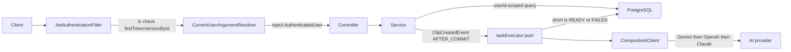

*Extracted from the `shadow-ai` repo source on 2026-06-20, checked against the code and cross-checked by a second adversarial pass. Numbers are measured, not estimated.*

## The shape of the system

Mimi is a YouTube-to-SRS English-shadowing app. The interesting part is the backend: a single Spring Boot / Java 21 monolith organized into per-feature DDD modules (`analysis`, `auth`, `billing`, `clip`, `deck`, `library`, `practice`, `recording`, `review`, `video`, plus `common`), backed by PostgreSQL with Flyway migrations and deployed to AWS ECS Fargate behind an ALB via Terraform. The Next.js frontend and React Native mobile app are separate workspaces; this writeup covers the backend only, where the work that's worth explaining lives — an async LLM analysis pipeline, repository-layer multi-tenant isolation, and env-gated provider/storage swaps.

| Surface | Size |
| --- | --- |
| Production Java | 8,892 LOC, 172 files |
| Test code | 3,009 LOC, 35 files, 121 `@Test` methods |
| REST surface | 15 controllers, 49 endpoints (20 GET / 20 POST / 5 DELETE / 4 PATCH) |
| Data model | 14 JPA `@Entity` classes, 13 `CREATE TABLE`, 20 Flyway migrations (226 LOC) |
| Multi-tenant scoping | 25 declared `userId`-scoped repo finder/count/exists/delete signatures |
| Transactions | 51 `@Transactional` methods |
| Terraform infra | 1,125 LOC; ECS cluster + service + task def, ALB, 2-subnet VPC, 8 Secrets Manager secrets, ECR, GitHub OIDC |

## Request path

Every authenticated request enters through `JwtAuthenticationFilter`, which parses the bearer token, validates the `tv` (token-version) claim against the DB, and lets `CurrentUserArgumentResolver` inject the `AuthenticatedUser` into the controller via the `@CurrentUser` parameter. From there the service issues a `userId`-scoped query. The async branch is separate: committing a clip fires an event that runs the LLM pipeline off-request on a bounded pool.

## The async LLM pipeline is pinned off the DB connection

A clip commit fires a `ClipCreatedEvent`. The listener `onClipCreated` in `ClipAnalysisService.java` is annotated `@TransactionalEventListener(AFTER_COMMIT)` plus `@Async`, so it runs only after the writing transaction commits, on a separate thread. The pipeline then deliberately splits its work across two short transactions with the network call in the gap: `prepareAnalysis` writes a `PENDING` row in a short `@Transactional` method, the seconds-long provider HTTP call happens OUTSIDE any transaction, and `completeAsReady` / `completeAsFailed` write the terminal `READY` / `FAILED` state in another short transaction.

Two details make this work. Self-invocation is routed through an `ObjectProvider<ClipAnalysisService>` self-proxy (`self()`) so the `@Async` / `@Transactional` advice actually fires — a plain `this.method()` call would bypass the proxy and silently run synchronously in the same transaction. The provider call is also wrapped in a Micrometer `Timer.Sample` that stops on the timer `tubeshadow.ai.analysis`, tagged by model and outcome, exposed at `/actuator/prometheus`.

The trade-off being bought: an LLM call can take seconds, and holding a Hikari connection for that whole window would exhaust the pool under any real load. Bookending the network call with two short transactions keeps connection-hold time minimal while still durably recording each state transition.

## Bounded async pool with CallerRuns back-pressure

`AsyncConfig.java` defines a `ThreadPoolTaskExecutor` named `taskExecutor` with core 2, max 4, queue 50, a `CallerRunsPolicy` rejection handler, and `waitForTasksToCompleteOnShutdown=true` with `awaitTerminationSeconds=30`, paired with `server.shutdown: graceful` in `application.yml`. `AsyncConfig` implements `AsyncConfigurer` and overrides `getAsyncExecutor()` to return that same singleton, so framework-managed `@Async` work and explicitly-named executor work share one pool rather than silently diverging.

Spring's default `@Async` executor is `SimpleAsyncTaskExecutor`, which spawns a fresh unbounded thread per task — a burst of clip imports would walk memory off a cliff. The bounded pool with `CallerRunsPolicy` degrades differently: once the queue fills, the submitting thread runs the task itself, which slows intake instead of dropping work or OOMing. The graceful-shutdown settings drain in-flight analyses on SIGTERM, which matters for clean rolling ECS deploys. The cost of this choice shows up below in the warts: max 4 threads is a hard ceiling.

## Multi-provider AI fallback chain

`CompositeAiClient.java` is the `@Primary` `AiAnalysisClient`. It injects every other `AiAnalysisClient` bean (excluding itself), orders them by the `tubeshadow.ai.order` property (default `gemini,openai,claude`), filters to providers whose API key is set via `isConfigured()`, and tries each in turn — falling through to the next on any `RuntimeException`, rethrowing the last if no fallback remains. Each concrete provider wraps its own HTTP call in `AiRetry.withRetry` from `AiRetry.java`: 3 attempts max, linear backoff of `500ms * attempt`, retrying ONLY `HttpClientErrorException.TooManyRequests` (429), `HttpServerErrorException` (5xx), and `ResourceAccessException` (IO timeout), and failing fast on any other 4xx. There is no Resilience4j or Spring Retry dependency; both the fallback ordering and the retry loop are hand-rolled.

The shape this is buying: a free-tier Gemini key can serve everyday traffic and spill over to paid OpenAI / Claude only on quota exhaustion or outage. Distinguishing transient failures (retry) from permanent ones (fail fast on a 401/400) means a bad key fails immediately instead of burning 3 retries plus the fallthrough.

## Repository-layer multi-tenant isolation as the chokepoint

Auth is stateless HS256 JWT. After `JwtAuthenticationFilter` validates the token and `CurrentUserArgumentResolver` injects the `AuthenticatedUser` (used across 11 controllers via `@CurrentUser`), isolation is enforced one layer down, in the repositories. Tenant-scoped finders carry the `userId` in their signature — 25 declared finder/count/exists/delete signatures such as `findByIdAndUserId`, `findByUserId`, `countByUserId`, including a raw `@Query` search in `ClipRepository.java` with `WHERE c.user_id = :userId`.

The reason to push the tenant predicate into the query rather than doing a global `findById` followed by an ownership check is failure mode. A cross-tenant id passed to `findByIdAndUserId` returns empty and the caller 404s — there's no row to leak. A forgotten ownership check on a global find, by contrast, leaks. Making isolation the default shape of the query means the fail-safe state is "no data" rather than "wrong tenant's data."

## JWT revocation via token-version, with a fail-fast secret guard

Tokens carry a `tv` (token-version) claim. On every authenticated request `JwtAuthenticationFilter` does one indexed PK lookup (`findTokenVersionById`, line 41) and rejects the token if the stored version no longer matches the claim. A password change bumps the version — the column was added in migration `V14__user_token_version.sql` with default `0` — which invalidates every previously-issued token at once. `JwtTokenProvider.java` additionally refuses to boot under the `prod` profile if the signing secret still starts with the public dev placeholder `dev-only-secret`, and requires at least 32 bytes for HS256.

Stateless JWTs normally can't be revoked before they expire; a single indexed version column buys logout-everywhere and password-change revocation cheaply. The prod secret guard catches a failure the length check alone would miss: a 32-byte-but-repo-public key would pass a length check and still be forgeable. The cost is one DB round-trip per request — covered in the warts.

## Env-gated storage and provider swaps

`RecordingStorage` is an interface with two implementations, `S3RecordingStorage.java` and `LocalRecordingStorage.java`, selected by `@ConditionalOnProperty(tubeshadow.recording.storage = s3 | local, matchIfMissing local)`. The S3 path returns a `ResponseInputStream` straight from `s3.getObject` rather than buffering the whole object onto the heap, and mirrors the local backend's `userId/clipId/uuid-name` key layout so the two are addressing-compatible. The same `@ConditionalOnProperty` gating covers the auth rate limiter (`AuthRateLimitFilter`) and the curated-video seeder (`CuratedCollectionSeeder`).

The point is that one artifact runs on a laptop against local disk and in ECS against S3 by flipping a single property — no code branch, no AWS credentials needed for local dev, and a prod storage-backend swap with no rebuild.

## SM-2 spaced repetition kept pure

`Sm2Calculator.java` is a `Clock`-injected SuperMemo-2 implementation: easiness floor `MIN_EASINESS = 1.3`, an Anki-style 0..5 quality mapping, repetitions and interval reset on a `quality < 3` lapse, returning an immutable `Sm2Result(easiness, intervalDays, repetitions, nextDueDate)`. It is deliberately separated from the JPA `ReviewItem` entity so `Sm2CalculatorTest.java` can exercise it without Spring or a database.

Keeping the scheduling math referentially transparent and `Clock`-driven makes it deterministically testable — feed a fixed clock and a quality score, assert the next due date — and decoupled from persistence concerns entirely.

## Constant-time billing webhook and OIDC deploy

The server-to-server billing webhook (`/api/billing/webhook`) is permit-listed past JWT in `SecurityConfig.java` (`permitAll`), but `BillingController.java` verifies an `X-Billing-Secret` header with `MessageDigest.isEqual` (constant-time) and fails CLOSED — `503 BILLING_NOT_CONFIGURED` — if no secret is configured. Constant-time compare avoids a timing oracle on the entitlement secret; failing closed prevents an unconfigured deploy from silently accepting plan writes. Infra in `iam.tf` and `ecs.tf` runs the Fargate service behind an ALB in a 2-subnet VPC with 8 Secrets Manager secrets, and a GitHub OIDC provider (`aws_iam_openid_connect_provider`) lets CI assume a deploy role without long-lived AWS keys. CORS in the app fails fast with an `IllegalStateException` if `CORS_ALLOWED_ORIGINS` is empty under the prod profile.

## What this architecture doesn't do

- The auth rate limiter is in-memory and single-instance. `AuthRateLimitFilter` keeps a plain `ConcurrentHashMap<ip, Bucket>` (line 44, populated via `computeIfAbsent` at line 74) with no eviction path at all — no `@Scheduled`, no `remove`, `clear`, or `evict`. The map grows unbounded with distinct client IPs, and because the limit isn't shared across tasks, running more than one ECS task multiplies the effective rate limit.
- Stateless JWT here isn't actually zero-DB. The `tv` revocation check means `JwtAuthenticationFilter` does a `findTokenVersionById` on every authenticated request (line 41). It's an indexed PK lookup, but there's no cache layer, so the usual "JWT = no DB hit" property doesn't hold.
- Fallback is exception-only and can stack up. `CompositeAiClient` only advances to the next provider on a thrown `RuntimeException`, and the inner `AiRetry` can burn up to 3 attempts × read-timeout per provider first. A multi-provider outage can occupy one async-pool thread for the summed retry time of every provider — and the pool max is only 4 threads, so a few simultaneous outages can stall the pipeline.
- Degraded outputs aren't distinguishable at a glance. `completeWithEmptyTranscript` (line 130) marks an analysis `READY` with a `Transcript unavailable.` placeholder body when the transcript is blank, while `completeAsFailed` (line 94) marks `FAILED` when no provider key is configured. Telling a real result from a degraded one means inspecting model/status, not reading the storage layer.
- Leftover scaffolding text. `backend/build.gradle.kts` line 31 still carries the comment `// Persistence (will be activated when DB tasks land)` directly above active `spring-boot-starter-data-jpa` and Flyway dependencies, with 20 migrations already in `db/migration` — the comment predates the work and was never removed.
