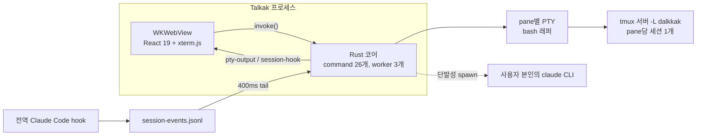

> **쉽게 말하면.** Talkak은 내 AI 코딩 비서(Claude Code나 Codex)를 항상 켜진 여러 터미널 창에서 돌리고, 그게 실제로 뭘 했는지 검색 가능한 기록으로 남기는 Mac 앱입니다. 어려운 핵심은, 창을 재배치하거나 앱을 재시작해도 그 AI 세션이 죽지 않는다는 것 — 세션이 앱이 아니라 백그라운드 세션 관리자(`tmux`) 안에 살기 때문입니다. AI 작업자 한 무리를 보는 관제실이라고 생각하면 됩니다: 각자 뭘 하는지 보이고, 위험한 동작은 내 승인을 기다리고, 앱을 꺼도 작업이 사라지지 않습니다.

*2026-06-10, v0.2.26 시점의 `ddalkkak` repo 소스에서 추출했습니다. 아래 모든 주장은 코드와 대조해 확인한 뒤, 별도의 적대적 검증 패스로 한 번 더 교차 검증했습니다. 숫자는 추정이 아니라 측정값입니다.*

이름 정리부터: 제품명은 **Talkak**(번들의 `productName`), repo는 `talkak`(`ddalkkak`에서 이름변경), 사용자 데이터 디렉토리는 `DalkkakAI`, tmux 소켓은 `dalkkak`입니다. 같은 프로젝트에 네이밍 역사가 세 겹 쌓여 있습니다.

## 시스템의 전체 모양

Talkak은 macOS 터미널 워크스페이스 앱입니다. Rust/Tauri 2 프로세스 하나가 WKWebView를 품고, 그 안에서 React 19 + xterm.js가 돌아갑니다. 서버는 없습니다. 아래 모든 것이 사용자 머신에서 실행됩니다.

| 영역 | 규모 |
| --- | --- |
| Rust 코어 | 3,605 LOC, 16개 파일 |
| 프론트엔드 (TS/TSX) | 12,078 LOC, 62개 파일 |
| 워크스페이스 패키지 | 6개 (실사용 2, 플레이스홀더 4), 합계 466 LOC |
| IPC 표면 | Tauri command 26개, event 2개 |
| 테스트 | Vitest 8개 스위트 (63개) + Rust `#[test]` 7개, 빌드에 게이트로 연결 |
| 릴리즈 | v0.2.26, 미서명, Apple Silicon 전용 |

흥미로운 숫자는 event 2개입니다. webview→Rust 방향은 요청/응답 command가 26개지만, Rust→webview 푸시는 `pty-output`(터미널 바이트)과 `session-hook`(Claude Code 활동) 둘뿐입니다. UI가 보여주는 나머지 전부 — 시스템 펄스, 사용량 게이지, 그래프 — 는 폴링입니다.

## 프로세스 모델

터미널 pane마다 `portable-pty`가 PTY를 열고, 자식으로 `/bin/bash -c` 래퍼를 띄웁니다. 래퍼는 먼저 tmux 서버의 환경을 정리하고 — `npm_config_*` 변수를 전부 제거하는데, 이게 pane 안에서 띄운 CLI를 망가뜨리던 nvm 상호작용 때문입니다 — 그다음 `tmux -L dalkkak new-session -A -D -s dalkkak-<id> -e DALKKAK_PANE_ID=<id>`를 실행합니다. 영속성 이야기의 전부가 `-A` 플래그입니다: 세션이 있으면 붙고, 없으면 만듭니다.

백그라운드 작업은 별도 프로세스가 아니라 in-process worker 3개입니다: git 캡처 폴링(20초), transcript 스캐너(20초), hook 파일 tail(400ms).

## 키 입력에서 픽셀까지

전체 루프는 이렇습니다: `term.onData`가 xterm의 focus-reporting 이스케이프를 제거하고(맨몸 ESC가 새어 나가면 Claude Code TUI가 인터럽트로 읽었습니다) `invoke("pty_write")` → Rust가 PTY master에 기록 → tmux → 전용 reader 스레드가 4,096바이트 청크로 읽어 `pty-output`으로 emit → 프론트엔드가 pane id로 라우팅해 해당 xterm 인스턴스에 `term.write`. 핫패스 밖에 스로틀이 두 개 있습니다: 진단용 파싱은 250ms마다 flush, 리사이즈는 120ms 디바운스라 mosaic 드래그가 SIGWINCH를 난사하지 않습니다.

## 터미널은 React 바깥에 산다

xterm 인스턴스는 컴포넌트 state가 아니라 모듈 레벨 `Map` 레지스트리에 들어 있습니다. react-mosaic은 레이아웃 트리가 바뀔 때마다 타일을 remount하는데, 터미널이 React 안에 살면 split 한 번에 PTY가 죽습니다. 대신 `TerminalPane`은 remount 때 레지스트리에 있는 기존 DOM 노드를 다시 붙이고, 파괴는 오직 명시적 동작(⌘W, Reset, 스타트업 삭제)으로만 일어납니다 — remount마다 cleanup이 발동하기 때문에, `useEffect` cleanup에서 destroy를 부르는 것을 레지스트리 주석이 금지합니다. VS Code가 터미널을 호스팅하는 패턴과 같습니다.

## tmux가 데이터베이스다

앱은 종료할 때 tmux 세션을 죽이지 않습니다. 세션과 그 안에서 돌던 `claude` 프로세스는 재실행 후에도 살아 있고 `-A`로 다시 붙습니다. 그 비용은 명시적으로 감수합니다:

- 워크스페이스 상태(스타트업 목록, 스타트업별 레이아웃 트리)는 webview localStorage에만 있습니다. WebKit이 지우면 tmux 세션은 살아 있지만 닿을 수 없는 고아가 됩니다.
- 고아 세션 GC가 Rust 코어에 있지만 프론트엔드 호출 지점이 0개입니다: 살아 있는 작업을 거둬 가버린 사고 후 2026-06-08에 비활성화했습니다. `INVARIANTS.md`에 사건이 기록돼 있고, detach된 세션은 이제 손으로 죽일 때까지 쌓입니다.
- tmux 자체가 강한 의존성이자 단일 장애점입니다. 머신에 tmux가 없으면 → 일반 셸, 영속성 없음.

## pane 귀속

상태 시스템 전체의 경첩이 환경변수 하나입니다. tmux가 각 세션에 `DALKKAK_PANE_ID`를 주입하고, 사용자의 전역 Claude Code 설정에 있는 hook이 그걸 읽어 pane이 찍힌 JSONL 라인을 `session-events.jsonl`에 추가하고, Rust가 그 파일을 400ms마다 tail해서 각 라인을 `session-hook` 이벤트로 다시 emit하고, 작은 `useSyncExternalStore` 스토어들이 hook 이름을 거친 pane 상태(thinking / tool-call / blocked / done)로 매핑합니다. ADR-001에 따라 상태는 터미널 출력 파싱이 아니라 hook에서 옵니다 — 원래 그 일을 하던 휴리스틱 스트림 파서는 아직 연결돼 있지만 dev 전용 로깅으로 강등됐습니다.

## AI는 bring-your-own

내장 모델도, API 키도, 프록시 서버도 없습니다. 정확히 두 개의 Rust 모듈이 사용자 본인의 `claude` 바이너리를 셸로 호출합니다: 세션 요약(`claude -p --output-format json --model claude-haiku-4-5`, 90초 타임아웃, transcript 마지막 12,000자)과 문장 교정(`claude-opus-4-8`, 150초 타임아웃). 둘 다 자식 환경에서 `ANTHROPIC_API_KEY`를 제거해, 호출이 사용자의 구독으로만 가고 실수로 API 청구가 나가지 않게 합니다.

실행 시 앱은 Talkak이 띄우는 모든 세션에 시스템 프롬프트 지시문을 덧붙이는 `claude` 래퍼 스크립트와, `~/.zshrc`에 마커로 보호된 셸 함수(append 전용, 1회 백업, Talkak pane 안에서만 활성)도 설치합니다. 사용량 게이지는 Codex 한도를 로컬 rollout JSONL에서 네트워크 호출 없이 읽고, Claude 사용량은 Keychain 자격증명으로 비공식 OAuth 엔드포인트에서 읽으며, 그게 깨지면 로컬 추정치로 폴백합니다.

## 그래프, 솔직하게

worker 두 개가 스타트업별 append 전용 JSONL "연결 레이어"를 채웁니다: git 커밋은 `change` 노드가 되고(20초 폴링, 최근 200커밋), 에이전트는 transcript에서 스캔되는 `dk-node` 블록으로 나머지 다섯 타입을 푸시할 수 있습니다 — 단일 Rust 검증 지점을 거치고, `change` 타입은 에이전트에게 금지됩니다. UI는 열 때 당겨올 뿐, 푸시는 없습니다.

repo 자신의 ADR-010(2026-06-07)이 어떤 외부 리뷰어보다 직설적입니다: 내부 레드팀 감사에서 노드 약 1,585개가 나왔는데 100%가 `change` 타입 — "git log를 다시 직렬화한 것" — 이었고, moat 주장에 대한 kill-criteria를 적어 두었습니다. 배관은 있습니다. 차별화된 데이터는 아직 없습니다.

## git push가 릴리즈 파이프라인이다

CI가 없습니다 — `.github/` 디렉토리 자체가 없습니다. `landing/`은 손으로 쓴 정적 HTML을 Vercel로 배포한 것인데, 업데이트 서버를 겸합니다: `latest.json`과 minisign 서명된 tarball이 repo에 커밋되므로 릴리즈가 곧 커밋 한 번입니다. 앱은 미서명·미공증이지만, 업데이트는 번들 설정에 박힌 공개키로 무결성 검증을 합니다. Full Disk Access를 요구하는 대신 Info.plist에 폴더별 사용 설명을 선언해 macOS TCC가 디렉토리 단위로 묻게 했습니다. webview CSP는 `null`입니다 — 로컬 전용 앱이라 감수할 만하지만, 실제로 풀어둔 부분입니다.

품질 게이트는 전부 로컬입니다: 빌드 스크립트가 `vitest run && tsc && vite build`(번들마다 테스트 63개가 게이트), Biome 린트, AI 세션의 완료 주장에 근거가 있는지 검사하는 fail-open Stop-hook, 그리고 항상 참이어야 하는 것과 그래도 깨진 것을 기록하는 `INVARIANTS.md` / `REGRESSIONS.md`. 이 글을 쓴 주의 회귀 로그: 회귀 8건, 사용자가 잡은 것 8건, 도구가 잡은 것 0건 — 테스트 하네스는 그 직후에 만들어졌습니다.

## 이 아키텍처가 하지 않는 것

- 구조적으로 macOS 전용: `~/Library/Logs` 경로, macOS `sysctl` 키, Keychain 읽기, zsh 전용 셸 함수 설치가 하드코딩.
- 페이월은 스텁 위에 올린 UI: entitlement 체크는 출시 전이라 현재 항상 "subscribed"를 반환하고, 14일 trial 시계는 dead code입니다. 프로젝트 README가 이를 공개하고 있습니다.
- 에러가 전부 문자열 타입(`Result<T, String>`): 존재하지 않는 pane id에 쓰기를 해도 조용히 성공합니다.
- 텔레메트리가 일절 없음 — 의도된 것이지만, 다른 사람 설치본에 대한 가시성도 0이라는 뜻입니다.
- GPU 렌더링은 보류: WebGL 애드온이 WKWebView에서 한국어 IME 조합을 깨뜨려, 모든 pane이 DOM 렌더러를 씁니다.
- 죽은 표면이 존재하고 트리 안에서 인정됨: 빌드에 연결된 적 없는 174 LOC Codex transcript 리더, 6개 중 4개가 2줄짜리 플레이스홀더인 워크스페이스 패키지, 참조되지 않는 mosaic 이전 레이아웃 컴포넌트.
- 로드맵이 첫 go/no-go로 정의한 1주 dogfood 게이트는 아직 공식적으로 실행된 적이 없고, 그 사이 v0.1.0 → v0.2.26이 출시됐습니다.
