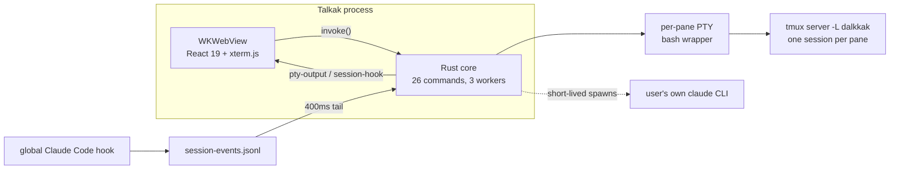

> **In plain words.** Talkak is a Mac app that runs your own AI coding assistant (Claude Code or Codex) across several always-on terminal windows, and keeps a searchable record of what it actually did. The hard trick: those AI sessions keep running even when you rearrange the windows or restart the app — they live in a background session manager called `tmux`, not in the app itself — so a screen change never kills the work. Think of it as a control room for a crew of AI workers: you watch each one, risky actions wait for your approval, and quitting the app doesn't lose their progress.

*Extracted from the `ddalkkak` repo source on 2026-06-10, at v0.2.26. Every claim below was checked against the code, then cross-checked by a second adversarial pass. Numbers are measured, not estimated.*

One naming note up front: the product is **Talkak** (the bundle's `productName`), the repo is `talkak` (renamed from `ddalkkak`), user-facing data directories use `DalkkakAI`, and the tmux socket is `dalkkak`. Same project, three layers of naming history.

## The shape of the system

Talkak is a macOS terminal-workspace app: one Rust/Tauri 2 process embedding a WKWebView that runs React 19 + xterm.js. There is no server. Everything below runs on the user's machine.

| Surface | Size |
| --- | --- |
| Rust core | 3,605 LOC, 16 files |
| Frontend (TS/TSX) | 12,078 LOC, 62 files |
| Workspace packages | 6 (2 live, 4 placeholders), 466 LOC total |
| IPC surface | 26 Tauri commands, 2 events |
| Tests | 8 Vitest suites (63 tests) + 7 Rust `#[test]`, gated into the build |
| Release | v0.2.26, unsigned, Apple Silicon only |

The two events are the interesting number. The webview→Rust direction has 26 request/response commands, but Rust→webview pushes only `pty-output` (terminal bytes) and `session-hook` (Claude Code activity). Everything else the UI shows — system pulse, usage gauges, the graph — is polled.

## Process model

Per terminal pane, `portable-pty` opens a PTY whose child is a `/bin/bash -c` wrapper. The wrapper first heals the tmux server's environment — it strips every `npm_config_*` variable, an nvm interaction that broke CLIs spawned inside panes — then runs `tmux -L dalkkak new-session -A -D -s dalkkak-<id> -e DALKKAK_PANE_ID=<id>`. The `-A` flag is the whole persistence story: attach if the session exists, create if not.

Background work is three in-process workers, not separate processes: a git-capture poll (every 20s), a transcript scanner (every 20s), and a hook-file tail (every 400ms).

## Keystroke to pixel

The full loop: `term.onData` strips xterm focus-reporting escapes (a leaked bare ESC was read as an interrupt by Claude Code's TUI), then `invoke("pty_write")` → Rust writes to the PTY master → tmux → a dedicated reader thread pulls 4,096-byte chunks and emits `pty-output` → the frontend routes by pane id into the right xterm instance and calls `term.write`. Two throttles sit off that hot path: diagnostic parsing flushes every 250ms, and resize is debounced 120ms so mosaic drags don't spam SIGWINCH.

## Terminals live outside React

xterm instances are held in a module-level `Map` registry, not in component state. react-mosaic remounts tiles whenever the layout tree changes; if terminals lived in React, every split would kill the PTY. Instead `TerminalPane` re-parents the registry's existing DOM node on remount, and destruction is only ever explicit (⌘W, Reset, Delete startup) — the registry's doc comment forbids calling destroy from `useEffect` cleanup, because cleanup fires on every remount. This is the same hosting pattern VS Code uses for its terminals.

## tmux is the database

The app never kills tmux sessions on quit. Sessions — and the `claude` processes running inside them — survive relaunch and reattach via `-A`. The costs are accepted explicitly:

- Workspace state (startup list, per-startup layout trees) lives only in webview localStorage. If WebKit wipes it, the tmux sessions survive but become unreachable orphans.
- An orphan-session GC exists in the Rust core but has zero frontend call sites: it was disabled on 2026-06-08 after it reaped live work. `INVARIANTS.md` records the incident; detached sessions now accumulate until killed by hand.
- tmux itself is a hard dependency and a single point of failure. No tmux on the machine → plain shell, no persistence.

## Pane attribution

The hinge of the whole status system is one environment variable. tmux injects `DALKKAK_PANE_ID` into each session; a hook in the user's global Claude Code config reads it and appends pane-stamped JSONL lines to `session-events.jsonl`; Rust tails that file every 400ms and re-emits each line as a `session-hook` event; small `useSyncExternalStore` stores map hook names to coarse pane states (thinking / tool-call / blocked / done). Per ADR-001, status comes from hooks, not from parsing the terminal output — the heuristic stream parser that originally did that is still wired in, demoted to dev-only logging.

## AI is bring-your-own

There is no bundled model, no API key, no proxy server. Exactly two Rust modules shell out to the user's own `claude` binary: session summarization (`claude -p --output-format json --model claude-haiku-4-5`, 90s timeout, last 12,000 chars of the transcript) and phrase correction (`claude-opus-4-8`, 150s timeout). Both remove `ANTHROPIC_API_KEY` from the child env so the call rides the user's subscription, never an accidental API bill.

At launch the app also installs a `claude` wrapper script that appends a system-prompt directive to every Talkak-spawned session, plus a marker-guarded shell function in `~/.zshrc` (append-only, one-time backup, active only inside Talkak panes). Usage gauges read Codex limits from local rollout JSONL with zero network calls, and Claude usage from an undocumented OAuth endpoint using Keychain credentials, falling back to a local estimate when that breaks.

## The graph, honestly

Two workers feed an append-only per-startup JSONL "connective layer": git commits become `change` nodes (20s poll, last 200 commits), and agents can push five other node types via `dk-node` blocks scanned out of their transcripts — validated at a single Rust chokepoint, with the `change` type forbidden to agents. The UI pulls this data on open; nothing pushes.

The repo's own ADR-010 (2026-06-07) is blunter about this than any outside reviewer: an internal red-team audit found ~1,585 nodes, 100% of them `change` type — "git log re-serialized" — and wrote kill-criteria for the moat claim. The plumbing exists; the differentiated data does not yet.

## git push is the release pipeline

There is no CI — no `.github/` directory at all. `landing/` is hand-written static HTML deployed by Vercel, and it doubles as the update server: `latest.json` and the minisign-signed tarball are committed into the repo, so a release is one commit. The app is unsigned and not notarized, but updates are integrity-checked against a public key embedded in the bundle config. Instead of requesting Full Disk Access, the Info.plist declares per-folder usage strings so macOS TCC prompts per directory. Webview CSP is `null` — tolerable for a local-only app, but a real loosening.

Quality gates are all local: the build script is `vitest run && tsc && vite build` (63 tests gate every bundle), Biome lints, a fail-open Stop-hook checks AI sessions' done-claims for evidence, and `INVARIANTS.md` / `REGRESSIONS.md` track what must stay true and what broke anyway. The week this was written, the regression log read: 8 regressions, 8 caught by the user, 0 by tooling — the test harness was built in direct response.

## What this architecture doesn't do

- macOS-only by construction: hardcoded `~/Library/Logs` paths, macOS `sysctl` keys, Keychain reads, zsh-only shell-function install.
- The paywall is wired UI over a stub: the entitlement check currently always returns "subscribed" pre-launch, and the 14-day trial clock is dead code. The project README discloses this.
- Errors are stringly typed (`Result<T, String>` everywhere); writing to an unknown pane id silently succeeds.
- No telemetry of any kind — deliberate, but it also means zero visibility into anyone else's install.
- GPU rendering is parked: the WebGL addon broke Korean IME composition in WKWebView, so every pane uses the DOM renderer.
- Dead surface exists and is admitted in-tree: a 174-LOC Codex transcript reader never wired into the build, 4 of 6 workspace packages that are 2-line placeholders, and unreferenced pre-mosaic layout components.
- The one-week dogfood gate the roadmap defined as the first go/no-go has still not formally run, while v0.1.0 → v0.2.26 shipped anyway.
