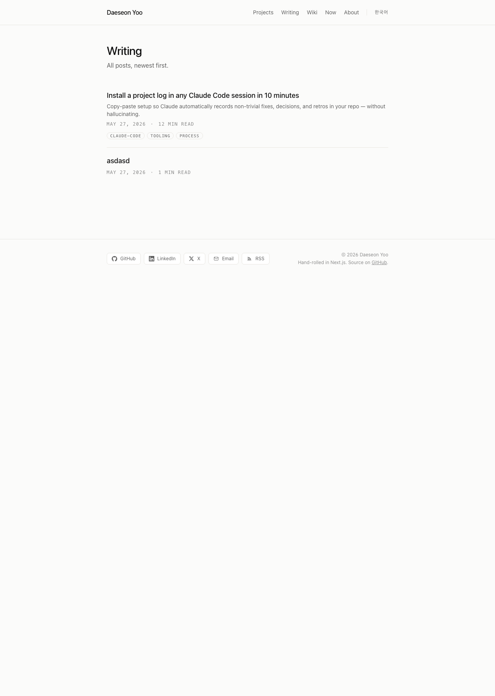
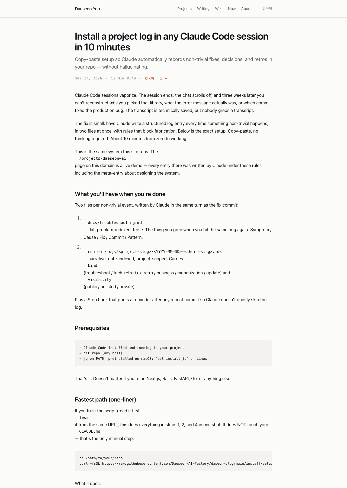
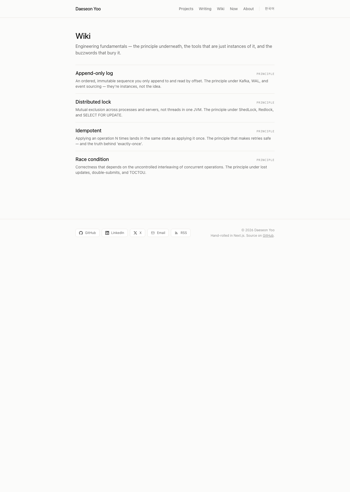
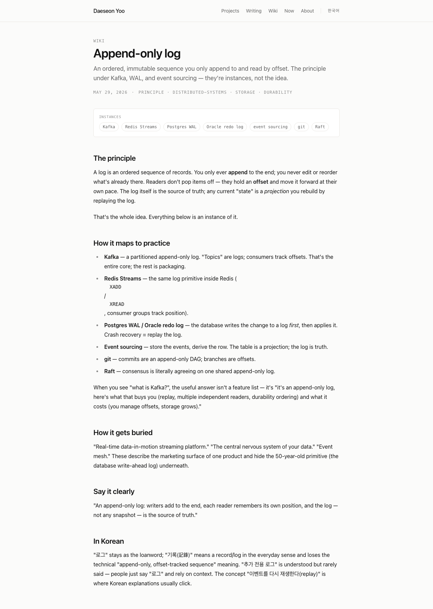
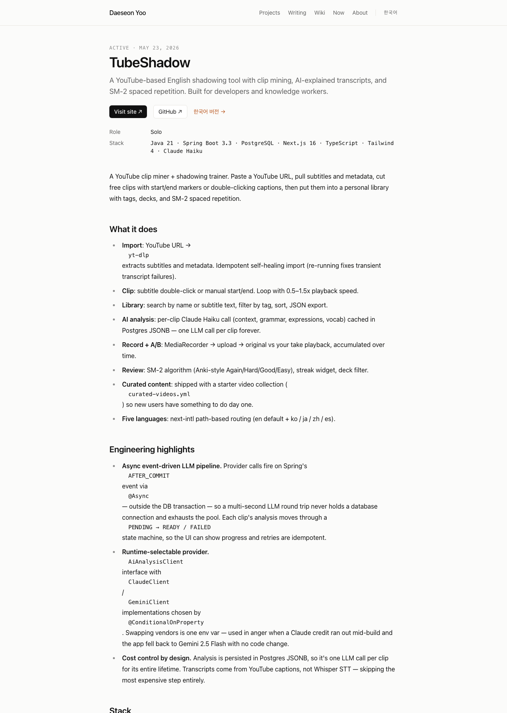
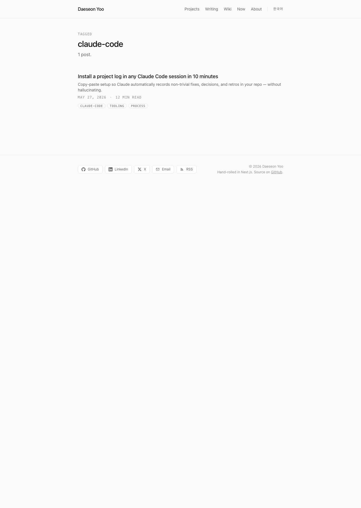
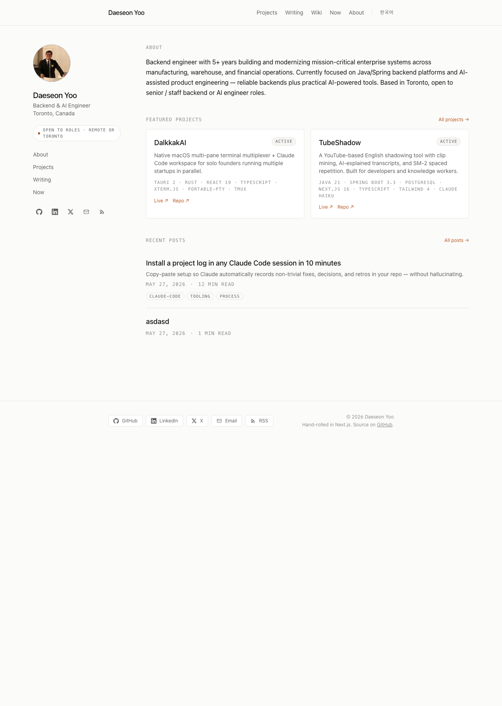
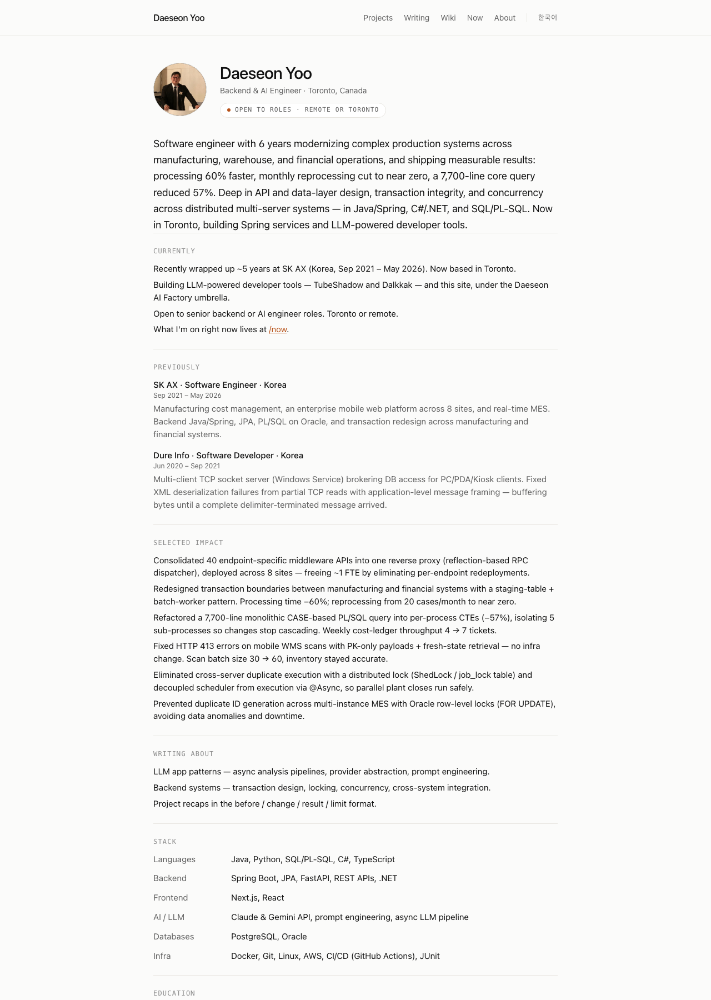

# daseon-blog 작성 가이드

> English version: [blog-guide.md](./blog-guide.md)

이 블로그에 콘텐츠를 직접 추가할 때 보는 핸드북. 어디에 뭘 쓰고, 어떤 frontmatter 박고, 푸시하면 언제 라이브로 보이는지.

스샷은 `docs/blog-guide-screens/` 아래에서 라이브 페이지를 캡처한 것 (`daeseon.ai` 2026-05-30 기준).

---

## 1. 전체 지도 — 어디에 뭘 쓰나

| 쓰려는 게 | 디렉토리 | 라이브 URL |
|---|---|---|
| **블로그 포스트** (회고·에세이·개념) | `content/posts/en/<slug>.mdx` (또는 `/ko/`) | `/posts/<slug>` |
| **위키 항목** (원리+사례) | `content/knowledge/en/<slug>.mdx` | `/wiki/<slug>` |
| **이 블로그의 프로젝트 타임라인** | `content/logs/daeseon-ai/<date>-<slug>.mdx` | `/projects/daeseon-ai` 타임라인 |
| **위성 프로젝트 타임라인** (shadow-ai · dalkkak-ai · docvault) | 해당 위성 repo의 `content/logs/<slug>/<date>-<slug>.mdx` | `/projects/<slug>` 타임라인 |
| **기존 AI 로그에 본인 commentary** | 같은 디렉토리에 `<date>-<slug>.human.mdx` | 그 entry 상세 페이지의 우측 컬럼 |

전부 mdx 직접 편집 (admin UI는 옵션 — 12장 참조).

---

## 2. 블로그 포스트 쓰기

### 어디

`content/posts/en/2026-05-30-<slug>.mdx`

slug = URL 마지막 segment. 파일명 = slug. 영문·하이픈·숫자만.

### Frontmatter 템플릿

회고/사례 글 (Format B, 추천 default):

```yaml
---
title: "한 줄 제목 (구체적으로)"
description: "1-2 문장 요약. 검색·SNS 미리보기에 노출됨."
date: "2026-05-30"        # 따옴표 필수
language: "en"
format: "before-after"
handwritten: true          # 본인이 직접 쓴 글이면
tags: ["industry-retro", "backend"]
---
```

개념 글 (Format A, 4-tone multi-register):

```yaml
---
title: "..."
description: "..."
date: "2026-05-30"
language: "en"
format: "multi-register"
handwritten: true
tags: ["concept", "..."]
---
```

### 본문 형식

**Format B** (Before / Change / Result / Limit) — 5~10 문장:

```mdx
## What I did
한 줄

## What it looked like before
구체적 상태 (숫자/스택/실패 모드)

## What I changed
무엇을 결정했나

## What happened
측정 가능한 결과

## What it doesn't do / what's next
한계
```

**Format A** — Raw / Marketing / Professional / Big-picture 4섹션. `CLAUDE.md`의 "Post Formats" 참조.

### 어떻게 보이나

목록 페이지:



상세 페이지:



`handwritten: true`면 메타 줄에 "BY HAND" 라벨이 자동으로 붙음.

---

## 3. 위키 항목 (fundamentals) 쓰기

위키는 **원리(principle)** 항목들의 모음. *"카프카가 뭐다"가 아니라 "이 원리가 있고, Kafka가 그 사례 중 하나다"*가 thesis. English-first.

### 어디

`content/knowledge/en/<slug>.mdx`

slug는 항목 이름의 kebab-case (예: `append-only-log`, `idempotent`).

### Frontmatter 템플릿

```yaml
---
title: "Append-only log"
description: "한 줄 — 이 원리가 뭔지."
date: "2026-05-30"
language: "en"
type: "knowledge"          # 필수
tags: ["principle", "..."]
instances: ["Kafka", "Redis Streams", "Postgres WAL", "event sourcing"]
handwritten: true
---
```

`instances` 배열이 곧 "이 원리의 사례들" — chip 블록으로 자동 렌더.

### 본문 구조 (5섹션 추천)

```mdx
## The principle
무엇인지, 기계적으로

## How it maps to practice
- **Kafka** — ...
- **Redis Streams** — ...
(원리의 사례들. instances 배열의 항목 하나하나가 여기 prose로도 등장)

## How it gets buried
어떤 buzzword·marketing-speak로 이 원리가 가려지는가

## Say it clearly
한 문장. buzzword 없이.

## In Korean
"멱등(冪等)"으로 번역되며 잃는 것 등 EN↔KO 뉘앙스
```

### 항목 사이 cross-link

`[[term]]` 또는 `[[표시할 텍스트|slug]]`:

```mdx
이게 [[race-condition]] 이라서 [[분산 락|distributed-lock]] 이 필요함.
```

자동으로 `/wiki/race-condition`, `/wiki/distributed-lock`으로 링크됨. 슬러그가 일치해야 작동.

### 어떻게 보이나

위키 목록 (알파벳 순):



위키 상세 (Instances 블록 + 본문):



타이틀 아래에 박힌 chip 블록이 `instances` frontmatter의 시각화.

---

## 4. 프로젝트 타임라인 entry

작업하면서 만나는 **사건**(troubleshoot, 결정, 회고, 마일스톤)을 시간 순으로 기록.

### 어디

| 프로젝트 | 경로 |
|---|---|
| **daseon-ai** (이 블로그 자체의 회고) | 이 repo의 `content/logs/daeseon-ai/<date>-<slug>.mdx` |
| **shadow-ai** | `Daeseon-AI-Factory/shadow-ai` repo의 `content/logs/shadow-ai/<date>-<slug>.mdx` |
| **dalkkak-ai** | `Daeseon-AI-Factory/ddalkkak` repo의 `content/logs/dalkkak-ai/<date>-<slug>.mdx` (슬러그≠repo이름 주의) |
| **docvault** | `Daeseon-AI-Factory/docvault` repo의 `content/logs/docvault/<date>-<slug>.mdx` |

위성 repo의 경우 그 repo에서 커밋+푸시. 30초 ISR 후 블로그가 자동으로 fetch.

### Frontmatter 템플릿

```yaml
---
title: "한 줄 제목 — 구체적"
date: "2026-05-30"
project: "shadow-ai"        # 슬러그 정확히
kind: "troubleshoot"        # 아래 표 참조
visibility: "public"        # business/monetization은 "private" 기본
language: "en"
summary: "한두 문장 — 타임라인 카드에 노출됨"
tags: ["..."]
handwritten: true           # 본인 직접 쓴 거면
---
```

### `kind` 선택

| kind | 언제 |
|---|---|
| `troubleshoot` | 구체적 버그·incident·디버깅 |
| `tech-retro` | 기술 결정 회고 (아키텍처·스택 선택) |
| `ux-retro` | UX·디자인 결정 회고 |
| `business` | 전략·비즈니스 결정 (기본 private) |
| `monetization` | 가격·수익 결정 (기본 private) |
| `update` | 릴리즈·마일스톤 |

판단 안 서면 `update`가 가장 안전한 default.

### Anti-hallucination 7규칙 (본인이 직접 쓸 때도 그대로 적용)

CLAUDE.md에 박힌 규칙 (요지):
1. **Symptom literal** — 실제 에러/출력 그대로 인용
2. **Cause verified** — 코드 읽고 검증한 것만. 추측이면 `Hypothesis:` + `Verified by:`
3. **Fix는 실제 변경 파일** (`git show` 기준)
4. **Commit hash는 실제 존재하는 것**
5. **Date는 git log 기준** 또는 오늘 날짜
6. **Pattern은 명백할 때만** — 패딩 금지
7. **메트릭 지어내지 마** — "약 60초"는 실제 본 경우만

### 어떻게 보이나

프로젝트 페이지의 타임라인 (상단의 description은 프로젝트 mdx에서, 아래는 로그 entry들이 자동 누적):



---

## 5. 기존 AI 로그에 본인 commentary 붙이기 (`.human.mdx`)

AI가 쓴 entry는 그대로 두고, 옆에 본인 시각을 **사이드바이사이드**로.

### 어디

**항상 이 블로그 repo 안에**, 위성 repo 아님. AI 글은 위성의 개발 history, companion은 블로그 콘텐츠(그 글에 대한 본인의 관점). repo 하나만 편집하면 됨.

```
daseon-blog/content/logs/shadow-ai/
└ 2026-05-23-yt-dlp-transcript-self-healing.human.mdx   ← 본인 글 (이 repo, 새로 만듦)

# AI 글은 자기 repo에 그대로:
shadow-ai/content/logs/shadow-ai/
└ 2026-05-23-yt-dlp-transcript-self-healing.mdx          ← 안 건드림
```

### 작성

frontmatter **없어도 됨**. 본문만:

```mdx
새벽 3시였는데 timedtext URL이 갑자기 빈 응답을 주기 시작했다.

처음엔 yt-dlp 도입을 망설였다 — 외부 subprocess라 배포가 까다로워질 거 같아서.
근데 결국 self-healing import 패턴이 더 큰 보상으로 돌아왔다 — ...

(본인 톤·관점·생생한 detail)
```

### 어떻게 보이나 (스샷은 첫 companion 만들고 나면)

데스크탑 (md+):

```
┌────────────────────┬────────────────────┐
│  AI VERSION        │  BY HAND           │
│                    │                    │
│  (AI 본문)         │  (본인 본문)         │
│                    │                    │
└────────────────────┴────────────────────┘
```

모바일: 위아래 스택, AI 먼저 그다음 본인.

companion 없는 entry는 그대로 단일 컬럼 (변화 없음).

### 첫 시도

가장 익숙한 사건 하나 골라서 시작 추천. shadow-ai의 yt-dlp나 dalkkak-ai의 v0.1.0 ship 같은 거.

---

## 6. 태그·필터링

### 태그 다는 법

위 모든 frontmatter에 `tags: [...]`. 일관된 태그 쓰는 게 핵심:

- `industry-retro` — 전 직장 회고 시리즈
- `principle` — 위키 원리 항목 (자동으로 거의 다 붙음)
- 본인이 정의하는 시리즈 태그 — 자유

### 태그 URL

`/posts/tag/<tag>`로 자동 모임. 예:

- https://daeseon.ai/posts/tag/industry-retro — 모든 직장 회고
- https://daeseon.ai/posts/tag/claude-code — claude-code 관련 글들

LinkedIn/이력서에 이 URL 직접 박아두면 리쿠르터가 한 클러스터씩 봄.

### 어떻게 보이나



태그 chip은 각 글 카드 아래 표시 — 클릭하면 그 태그 모음으로 이동.

---

## 7. "BY HAND" 마커 — 본인이 쓴 거 vs AI가 쓴 거

frontmatter에 `handwritten: true` 한 줄.

```yaml
handwritten: true
```

자동으로 메타 줄에 "BY HAND" (영문) / "직접" (한국어) 추가 — 작은 monospace 라벨, chip 아님 (절제된 디자인).

**적용 surface:**
- `/posts` 상세 + 목록 카드
- `/wiki` 상세
- 프로젝트 로그 타임라인 카드

AI-assisted한 글이면 그냥 안 적음 (라벨 안 붙음). 보수적으로 박을수록 시그널.

---

## 8. EN/KO — 영어 우선

블로그 자체는 이중언어. 하지만 **본인의 default는 영어**.

| 컨텐츠 | 어떻게 |
|---|---|
| 위키 항목 | 영어로만 작성. 한국어는 `## In Korean` 섹션으로 본문 안 |
| 블로그 포스트 | 영어 우선. 본인이 원하면 KO 미러도 가능 (`content/posts/ko/`, `translationKey`로 연결) |
| 프로젝트 로그 | 영어 (위성 repo 관례) |

**KO 미러 페이지 만들 필요 없음.** 한국어는 *영어 항목 내부*에 부가 요소로.

(블로그 인프라가 KO 라우트를 다 갖추고 있긴 함 — `/ko/posts`, `/ko/wiki` 등. 안 채우면 비어있을 뿐, 에러 안 남.)

---

## 9. 발행 & 라이브 타이밍

### 흐름

```bash
# 글 작성
vim content/posts/en/2026-05-30-my-first-retro.mdx

# 로컬에서 build·렌더 확인 (선택)
npm run build

# 커밋·푸시
git add content/posts/en/2026-05-30-my-first-retro.mdx
git commit -m "post: <slug>"
git push origin main
```

### 언제 보이나

- **위성 repo의 로그 entry**: 푸시 → 블로그가 30초 ISR로 자동 fetch → 라이브
- **이 repo의 글/위키/로그**: 푸시 → Vercel 재빌드 (~1-2분) → 라이브

기존 페이지의 캐시는 30초 ISR이라 첫 방문자가 새 빌드를 트리거.

### git push 안 하고 로컬에서 미리 보고 싶으면

```bash
npm run dev
# http://localhost:3000
```

dev 서버는 파일 변경 즉시 반영.

---

## 10. Admin UI vs 직접 mdx

`/admin` 페이지는 form 입력으로 글·프로젝트 생성. 어떤 게 좋은가:

| 작업 | 추천 |
|---|---|
| 빠르게 프로젝트 mdx 만들기 | Admin (form이 빠름) |
| 글 작성·편집 | **직접 mdx** (Admin은 plain text editor 수준) |
| 로그 entry 추가 | **직접 mdx** (Admin에 form 없음) |
| `.human.mdx` companion | **직접 mdx만** (Admin 미지원) |

요약: **글·로그·companion은 mdx 직접**, 프로젝트 생성만 admin이 편함.

Admin 접속: `http://localhost:3000/admin` → `.env.local`의 `ADMIN_PASSWORD` 입력. (production은 같은 URL + 같은 비번)

---

## 11. 회고 글 — 기밀 / fingerprint 체크리스트

전 직장 회고 쓸 때마다 발행 전 확인:

| 영역 | 안전 ✅ | 위험 ❌ |
|---|---|---|
| 회사명 | "한국 대형 SI" | "SK AX" |
| 고객사 | 언급 없음 | 실제 이름 |
| 시스템 | "MES", "원가 관리" | 내부 제품명 |
| 규모 | 자리수 ("수만 RPS") | 정확 수치·매출 |
| 기술 스택 | Spring·Oracle·Java | 자사 내부 라이브러리명 |
| 아키텍처 | "staging-table + batch-worker 패턴" | 실 토폴로지·서버 사양 |
| 본인 결정·trade-off | 자유 | — |

**Fingerprint 테스트**: "옛 동료가 읽으면 어떤 프로젝트인지 알아볼 수 있나?" Yes면 더 추상화.

**기준선**: 본인 이력서에 적힌 디테일 (8 sites, 7,700-line PL/SQL 등)이 안전선. 그보다 더 구체면 멈추고 다시 생각.

발행 전 신뢰하는 옛 동료에게 한 번 보여주기 (본인은 본인 fingerprint에 가장 둔감).

---

## 12. 자주 빠지는 함정

1. **YAML 날짜는 반드시 따옴표.** `date: 2026-05-30`(unquoted)이 아니라 `date: "2026-05-30"`. unquoted ISO 날짜를 YAML이 `Date` 객체로 파싱해 빌드 깨짐 (`c3517f5`에서 한 번 막아둠).

2. **프로젝트 mdx의 `url` 필수.** 비어있으면 로더가 필터링해서 페이지 자체가 안 만들어짐. 라이브 배포 없으면 GitHub URL이라도 박을 것.

3. **위키 `[[term]]`은 slug 일치.** `[[Append-only log]]`처럼 표시는 자유지만 slug는 `[[append-only-log]]` 또는 `[[표시|append-only-log]]`. 존재 안 하는 slug는 404 dead-link.

4. **위성 repo의 슬러그 ≠ repo 이름일 수도.** dalkkak-ai의 경우 repo는 `ddalkkak`인데 slug는 `dalkkak-ai`. 새 위성 추가할 때 slug 미리 정해두기.

5. **`content/knowledge/ko/`는 비워둠** (English-first). 위키 한국어 미러 만들지 말 것.

6. **`.human.mdx`는 frontmatter 없어도 됨.** 있어도 무시됨. 본문만 적기.

7. **새 글 / 새 항목 추가 시 dual-write는 필요 없음.** dual-write는 *코드 변경* + 비-trivial한 결정의 책임 (`CLAUDE.md` 참조). 콘텐츠 추가는 그냥 커밋 + 푸시.

---

## 13. 첫 회고 글 — 정확한 5단계

지금 가장 빠른 첫 글 발행 경로:

```bash
# 1. 파일 만들기
touch content/posts/en/2026-05-30-<your-slug>.mdx

# 2. 본문 작성 (frontmatter는 아래 템플릿 그대로)
```

```yaml
---
title: "..."
description: "..."
date: "2026-05-30"
language: "en"
format: "before-after"
handwritten: true
tags: ["industry-retro"]
---

## What I did
...

## What it looked like before
...

## What I changed
...

## What happened
...

## What it doesn't do / what's next
...
```

```bash
# 3. 로컬 미리보기 (선택)
npm run dev
# → http://localhost:3000/posts/2026-05-30-<your-slug>

# 4. 빌드 검증 (선택)
npm run build

# 5. 푸시
git add content/posts/en/2026-05-30-<your-slug>.mdx
git commit -m "post: <slug>"
git push origin main
```

1-2분 후 라이브:
- 본문: `https://daeseon.ai/posts/2026-05-30-<slug>`
- 태그 모음: `https://daeseon.ai/posts/tag/industry-retro`
- 목록: `https://daeseon.ai/posts` (메타에 "BY HAND" 표시)

---

## 14. 참고 — 라이브 페이지로 직접 보기

| 페이지 | URL |
|---|---|
| 홈 | https://daeseon.ai/ |
| 글 목록 | https://daeseon.ai/posts |
| 글 상세 (예시) | https://daeseon.ai/posts/install-claude-code-project-log |
| 태그 필터 | https://daeseon.ai/posts/tag/claude-code |
| 위키 목록 | https://daeseon.ai/wiki |
| 위키 상세 (예시) | https://daeseon.ai/wiki/append-only-log |
| 프로젝트 (예시) | https://daeseon.ai/projects/shadow-ai |
| 소개 | https://daeseon.ai/about |




---

## 15. 가이드 업데이트

이 파일은 직접 편집. 스샷은 다음 명령으로 다시 캡처:

```bash
CHROME="/Applications/Google Chrome.app/Contents/MacOS/Google Chrome"
"$CHROME" --headless --disable-gpu --hide-scrollbars \
  --window-size=1280,1800 \
  --screenshot=docs/blog-guide-screens/<name>.png \
  "https://daeseon.ai/<path>"
```

페이지 디자인이 크게 바뀌면 (5포스트 이후 redesign 시점에) 스샷도 같이 새로 찍기.
